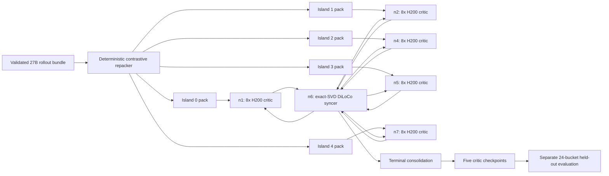

# Qwen3.8-27B value-pretraining handoff

Status date: 2026-08-27/28 UTC

This handoff covers the repaired offline SAO critic/value-pretraining path for
Qwen3.8-27B. It does not claim that the 240-step production training or its
held-out evaluation has completed. A 48-step, production-shape canary is
running while this branch is prepared for review.

## Review branches and bases

- Yeto branch: [`fix/qwen38-value-stratified-replay`](https://github.com/agentenv/yeto/tree/fix/qwen38-value-stratified-replay)
- Yeto base: `integrate/qwen38-value-v7-isoloco` at `55076ff9a8fbaea416988ba79f0cfb363014b6ec`
- Miles companion branch: [`fix/qwen38-value-bounded-head`](https://github.com/agentenv/miles-values/tree/fix/qwen38-value-bounded-head)
- Miles base: `codex/qwen38-value-v7` at `8e70c90d057accb26d9f58013452024e695affb0`
- Miles handoff commit pinned by the launcher: `d82b13b4beff4e0e4df7f3a4f9f804bd381feea1`

The Yeto branch owns deterministic replay construction, launch-time contract
checks, and the five-island exact-SVD topology. The Miles branch owns metadata
propagation, weighted critic reduction under context parallelism, and pooled EV
analysis. Both branches are required.

## Architecture



Each learner is one fixed-quorum island using all eight local H200s with
TP4/CP2/PP1/DP1 and sequence length 262,144. The sync interval is H=12. The
sixth active node runs the eight-GPU exact Torch-SVD syncer. n3 is deliberately
spare; adding a sixth learner would require repartitioning the data and changing
the fixed roster/quorum.

This is offline critic training: there are no rollout/inference workers in this
job. Online SAO consumes the pretrained value checkpoint later.

## Root causes and fixes

| Audit item | Resolution |
| --- | --- |
| Label-sorted sequential replay | Added a deterministic repacker that preserves islands, splits, samples, semantic hashes, and atomic compaction-thread groups while making every optimizer bucket and every H=12 window contain both rewards. |
| Unbounded MSE critic | Production launcher now requires 51-bin HL-Gauss classification on reward support `[0, 1]` with sigma ratio `0.75`. |
| PPO value clipping | The selected classification path does not apply PPO value clipping. Historical telemetry also showed zero clipping, so clipping was not established as the causal defect in the prior run. |
| LR horizon mismatched to useful data | Warmup remains five nominal iterations; cosine decay is 138 nominal iterations, corresponding to 690 local contexts for the audited 687-context island. |
| Correlated compaction fragments over-weighted | Each atomic source thread now contributes equal total weight within its optimizer bucket while total sample weight remains equal to dynamic batch size. Miles already used per-sample rather than per-token loss normalization; the new weights correct the remaining group-size bias. |
| No usable early signal | Exact sufficient statistics remain logged every critic step. The companion aggregator now pools all island logs, calculates global EV/MSE/baseline/calibration, and can fail on a minimum-EV threshold. The current canary is a manual go/no-go gate; automatic mid-run termination is not included. |
| Validation parser failed on real logs | The aggregator accepts both bare statistic names and the emitted `train/critic-*` keys, rejects incomplete ranges, and prevents cross-island step-ID overwrites. |
| Unsafe configuration surface | The production launcher fails before GPU reservation unless the pack schema, recipe, label mixing, context counts, Miles revision, and a content hash of the Miles value-training contract all match. Generic Miles defaults are unchanged. |

## Rebuilt replay bundle

Source bundle on learner nodes:

```text
/data/local-runs/qwen38-value-five-islands-merged-20260826-v1
```

Audited output bundle:

```text
/data/local-runs/qwen38-value-five-islands-contrastive-20260827-v2
```

Build command:

```bash
python3 scripts/reorder_miles_value_five_islands.py \
  --parent /data/local-runs/qwen38-value-five-islands-merged-20260826-v1 \
  --output /data/local-runs/qwen38-value-five-islands-contrastive-20260827-v2 \
  --train-rollouts 240 \
  --validation-rollouts 24 \
  --window-size 12 \
  --seed 20260827
```

Exact audited totals:

- 1,320 tensor files and 3,843 contexts
- 240 train buckets plus 24 held-out buckets per island
- 3,435 train contexts and 408 held-out contexts
- 1,722 reward-0 and 2,121 reward-1 contexts
- 360,326,320 total tokens and 234,866,216 supervised tokens
- no duplicated or omitted contexts, no split atomic groups, and no empty files
- every train step and every H=12 window contains both labels
- maximum per-step positive-rate deviation: 0.0191
- all recorded artifact checksums and semantic checks passed

The per-context weight for a group in a bucket is:

```text
bucket_context_count / (atomic_group_count * atomic_group_context_count)
```

Therefore each atomic group has the same total weight, and all weights in the
bucket still sum to the number of contexts expected by Miles's dynamic-GBS
normalization.

## Validation completed before GPU launch

- Yeto focused suite: 22/22 passed.
- Miles focused suite in the staged Linux runtime: 33/33 passed.
- Yeto exact-SVD syncer release suite: 117/117 passed.
- The CP=2 zigzag weighted reducer was checked numerically against the intended
  full-sequence weighted loss.
- Full remote artifact audit checked all 1,320 tensors, 3,843 contexts, and
  1,325 recorded checksums.
- Qwen3.8-27B distributed checkpoints on n4 and n5 matched exactly across all
  20 files.
- Every learner passed the fail-closed launcher contract before GPU launch.
- `git diff --check`, Ruff, and shell syntax checks passed.

## Active 48-step production-shape canary

Run tag:

```text
qwen38-value-contrastive-hlgauss-b48-20260827-v3
```

Topology:

| Role | Nodes | Layout |
| --- | --- | --- |
| Learners | n1, n2, n4, n5, n7 | one 27B critic island per node; 8x H200; TP4/CP2/PP1/DP1 |
| Syncer | n6 | exact Torch SVD over 8x H200; five-member full quorum |
| Spare | n3 | intentionally unused |

Important settings are H=12, 96 fragments, four streams, BF16 authoritative
parameters, HeLoCo delta correction, outer LR 0.7, outer momentum 0.9, and merge
alpha 0.5. The canary saves only at step 48 to avoid multiple approximately
442-GB critic checkpoints on n7.

W&B runs:

- [island 0](https://wandb.ai/yeta/qwen38-value-pretrain/runs/rzhrh386)
- [island 1](https://wandb.ai/yeta/qwen38-value-pretrain/runs/k12iriux)
- [island 2](https://wandb.ai/yeta/qwen38-value-pretrain/runs/5g2xnjrs)
- [island 3](https://wandb.ai/yeta/qwen38-value-pretrain/runs/gmuzb8f2)
- [island 4](https://wandb.ai/yeta/qwen38-value-pretrain/runs/bqlr4i9v)

At the 02:22 UTC handoff snapshot, learners had completed 15-17 of 48 optimizer
steps (16, 17, 16, 17, and 15 by island), with no fatal traceback, runtime
error, or CUDA OOM. Loss had fallen on every island from roughly 12-15 at the
first step to roughly 9.5-10.8. The first pooled
H=12 window completed with EV `-0.12738`, critic MSE `0.2660`, constant-baseline
MSE `0.23544`, and absolute calibration error `0.0239`. This is not yet a
production green light: the canary must demonstrate improving EV over later
windows. Exact-SVD synchronization had begun and reached global fragment step
24 of 96, but no complete 96-fragment sweep or terminal finalization had
occurred. The tightest observed HBM use was approximately 142.1/143.8 GB. The
memory-saver emitted nonfatal allocation-denial warnings on n4, n5, and n7 to
preserve the configured 1-GiB margin; training continued.

The earlier `v2` launch is separate zero-step evidence only. It was stopped
before model training because Ray inherited stale Tailscale addresses in
`MILES_NODE_ORDER`. For `v3`, every Ray head and learner launcher was restarted
with its own public address. Do not merge or interpret `v2` artifacts as
training output.

Runtime paths follow this pattern:

```text
/data/local-runs/qwen38-value-contrastive-hlgauss-b48-20260827-v3-learner{0..4}
/data/local-runs/qwen38-value-contrastive-hlgauss-b48-20260827-v3-learner{0..4}.launcher.log
/data/local-runs/qwen38-value-contrastive-hlgauss-b48-20260827-v3-syncer
```

## Canary acceptance gates

Do not treat the canary as a production green light until all of these hold:

1. Every learner completes 48/48 optimizer steps without NaN, OOM, or process
   failure.
2. Loss and pooled EV show a credible learning direction after warmup; a fresh
   untrained head can have negative EV initially.
3. Any ordinary DiLoCo merge that becomes eligible completes successfully.
   Asynchronous fragment timing means an ordinary full sweep is likely but not
   guaranteed within only 48 local steps.
4. The supervisor writes the learner-budget cutoff, runs phase-two exact-SVD
   consolidation over all 96 fragments and all five learners, and publishes the
   final marker only afterward.
5. Each learner publishes the step-48 critic checkpoint and n7 retains adequate
   disk space.
6. A separate 24-bucket held-out evaluation produces pooled EV above zero and
   acceptable MSE/calibration.

## Held-out evaluation launchbook

Gate #6 for run tag `qwen38-value-contrastive-hlgauss-b48-20260828-v5`. The
launcher is `scripts/run_miles_value_offline_validation.sh` (this branch),
deployed with the compat-only hook `yeto_value_validation_hook.py` at
`/data/yeto-contrastive-20260827-v2/` on every learner node. It replays
validation buckets 240..263 through the normal Miles critic train step with
bit-frozen parameters (`--critic-lr 1e-30 --lr 1e-30 --min-lr 0.0
--weight-decay 0.0`: every Adam/decay update is below one FP32 ulp, so all
forwards run against the unchanged step-48 checkpoint), the 51-bin HL-Gauss
recipe, no Yeto syncer hooks, no W&B, `--no-load-optim --no-load-rng`, and
save intervals far beyond 24 steps. It fails closed before reserving GPUs
unless the tracker reads exactly 47, `iter_0000047/.metadata` exists, all 24
bucket files are readable, the manifest held-out range is exactly 240..263
with the audited recipe, the Miles checkout is pinned at
`1683344de810654c781f8c04cbd118f296918a88` with the audited contract hash, the
output directory is fresh, and no GPU compute process is present.

Prerequisites on every learner node (the launcher checks most of these, but
check before firing):

- `/data/local-runs/qwen38-value-contrastive-hlgauss-b48-20260828-v5-learner<N>/critic_checkpoints/latest_checkpointed_iteration.txt`
  reads `47` and `iter_0000047/.metadata` exists.
- The canary learner has fully exited: training systemd unit inactive,
  `nvidia-smi` compute PID count 0, Ray ALIVE actors 0, Ray CREATED placement
  groups 0. Phase-2 consolidation on n6 must be complete. Do not start the
  eval against a live learner; the launcher's GPU-occupancy gate would refuse
  anyway.
- Never use h200-n3.

Step 1: start a Ray head on each learner node with its own public address in
`MILES_NODE_ORDER` (only after the canary learner has exited):

```bash
rrun h200-n1 -- 'docker exec -i miles_node bash -lc "export MILES_NODE_ORDER=208.64.254.75;  ray stop --force; ray start --head --node-ip-address 208.64.254.75  --num-gpus 8 --disable-usage-stats --dashboard-host=0.0.0.0 --dashboard-port=8265"'
rrun h200-n2 -- 'docker exec -i miles_node bash -lc "export MILES_NODE_ORDER=208.64.254.76;  ray stop --force; ray start --head --node-ip-address 208.64.254.76  --num-gpus 8 --disable-usage-stats --dashboard-host=0.0.0.0 --dashboard-port=8265"'
rrun h200-n4 -- 'docker exec -i miles_node bash -lc "export MILES_NODE_ORDER=208.64.254.177; ray stop --force; ray start --head --node-ip-address 208.64.254.177 --num-gpus 8 --disable-usage-stats --dashboard-host=0.0.0.0 --dashboard-port=8265"'
rrun h200-n5 -- 'docker exec -i miles_node bash -lc "export MILES_NODE_ORDER=208.64.254.178; ray stop --force; ray start --head --node-ip-address 208.64.254.178 --num-gpus 8 --disable-usage-stats --dashboard-host=0.0.0.0 --dashboard-port=8265"'
rrun h200-n7 -- 'docker exec -i miles_node bash -lc "export MILES_NODE_ORDER=208.64.254.181; ray stop --force; ray start --head --node-ip-address 208.64.254.181 --num-gpus 8 --disable-usage-stats --dashboard-host=0.0.0.0 --dashboard-port=8265"'
```

Step 2: launch one eval island per node. Each `OUTPUT_DIR` must be fresh; the
launcher refuses anything that already exists.

```bash
rrun --detach yeto-eval-island0 h200-n1 -- 'docker exec -i miles_node bash -lc "export MILES_NODE_ORDER=208.64.254.75  ISLAND_ID=0 CRITIC_LOAD_DIR=/data/local-runs/qwen38-value-contrastive-hlgauss-b48-20260828-v5-learner0/critic_checkpoints OUTPUT_DIR=/data/local-runs/qwen38-value-contrastive-hlgauss-b48-20260828-v5-eval-island0; bash /data/yeto-contrastive-20260827-v2/scripts/run_miles_value_offline_validation.sh"'
rrun --detach yeto-eval-island1 h200-n2 -- 'docker exec -i miles_node bash -lc "export MILES_NODE_ORDER=208.64.254.76  ISLAND_ID=1 CRITIC_LOAD_DIR=/data/local-runs/qwen38-value-contrastive-hlgauss-b48-20260828-v5-learner1/critic_checkpoints OUTPUT_DIR=/data/local-runs/qwen38-value-contrastive-hlgauss-b48-20260828-v5-eval-island1; bash /data/yeto-contrastive-20260827-v2/scripts/run_miles_value_offline_validation.sh"'
rrun --detach yeto-eval-island2 h200-n4 -- 'docker exec -i miles_node bash -lc "export MILES_NODE_ORDER=208.64.254.177 ISLAND_ID=2 CRITIC_LOAD_DIR=/data/local-runs/qwen38-value-contrastive-hlgauss-b48-20260828-v5-learner2/critic_checkpoints OUTPUT_DIR=/data/local-runs/qwen38-value-contrastive-hlgauss-b48-20260828-v5-eval-island2; bash /data/yeto-contrastive-20260827-v2/scripts/run_miles_value_offline_validation.sh"'
rrun --detach yeto-eval-island3 h200-n5 -- 'docker exec -i miles_node bash -lc "export MILES_NODE_ORDER=208.64.254.178 ISLAND_ID=3 CRITIC_LOAD_DIR=/data/local-runs/qwen38-value-contrastive-hlgauss-b48-20260828-v5-learner3/critic_checkpoints OUTPUT_DIR=/data/local-runs/qwen38-value-contrastive-hlgauss-b48-20260828-v5-eval-island3; bash /data/yeto-contrastive-20260827-v2/scripts/run_miles_value_offline_validation.sh"'
rrun --detach yeto-eval-island4 h200-n7 -- 'docker exec -i miles_node bash -lc "export MILES_NODE_ORDER=208.64.254.181 ISLAND_ID=4 CRITIC_LOAD_DIR=/data/local-runs/qwen38-value-contrastive-hlgauss-b48-20260828-v5-learner4/critic_checkpoints OUTPUT_DIR=/data/local-runs/qwen38-value-contrastive-hlgauss-b48-20260828-v5-eval-island4; bash /data/yeto-contrastive-20260827-v2/scripts/run_miles_value_offline_validation.sh"'
```

Step 3: monitor. Each unit logs to `/root/yeto-eval-island<N>.log` on its
host. systemd transient units vanish on failure, so judge by the log file,
not `systemctl is-active`. Expect exactly 24 `critic-step` lines per island
carrying `train/critic-value_{loss,ev_n,returns_sum,returns_sq_sum,
residual_sum,residual_sq_sum}` for rollout ids 240..263.

Step 4: collect the five logs and pool them for ONE global EV. Never average
per-island EVs; the aggregator pools the exact sufficient statistics and
rejects any log that does not cover the complete 240..263 range.

```bash
mkdir -p /tmp/qwen38-v5-eval && cd /tmp/qwen38-v5-eval
rrun h200-n1 -- 'cat /root/yeto-eval-island0.log' > island0.log
rrun h200-n2 -- 'cat /root/yeto-eval-island1.log' > island1.log
rrun h200-n4 -- 'cat /root/yeto-eval-island2.log' > island2.log
rrun h200-n5 -- 'cat /root/yeto-eval-island3.log' > island3.log
rrun h200-n7 -- 'cat /root/yeto-eval-island4.log' > island4.log
rrun h200-n1 -- 'docker exec miles_node cat /data/miles-values-contrastive-20260827-v2/scripts/tools/aggregate_offline_validation_ev.py' \
  > aggregate_offline_validation_ev.py
python3 aggregate_offline_validation_ev.py \
  island0.log island1.log island2.log island3.log island4.log \
  --validation-start-rollout 240 --num-rollout 264 \
  --minimum-explained-variance 0.0
```

Gate #6 passes only if the pooled `held_out_explained_variance` is above zero
(exit code 0; the aggregator exits 3 at or below the threshold) with
acceptable pooled MSE, constant-baseline MSE, and absolute calibration error.
The per-island breakdown in the aggregator output is diagnostic only.

## Production launch notes

Once the canary passes, use the same topology and pack with
`LOCAL_BUDGET_STEPS=240`. The branch defaults are still `SAVE_INTERVAL=15` and
`SAVE_RETAIN_INTERVAL=999990`; the canary explicitly overrides both to 48.
For the full run, explicitly set both to 240 if only one approximately 442-GB
final critic checkpoint per learner is desired. This saves disk but provides no
mid-run learner checkpoint recovery.

Disk must be rechecked after the canary finalizes. n7 had only approximately
700 GB free before the canary, so retaining its approximately 442-GB canary
checkpoint and then writing a full-run checkpoint will not fit. Before the full
run, either copy/archive and recoverably remove the canary checkpoint with
explicit operator approval, add capacity, or use a different node. Do not
launch and defer this check until the final save.

The launcher requires:

- `LEARNER_ID=0..4`
- `SYNCER_ADDR=<n6-public-address>:<port>`
- `ISLAND_DATA_TEMPLATE=/data/local-runs/qwen38-value-five-islands-contrastive-20260827-v2/island_<id>/data_{rollout_id}.pt`
- a fresh absolute `OUTPUT_DIR`
- `MILES_ROOT=/data/miles-values-contrastive-20260827-v2`
- `YETO_ROOT=/data/yeto-contrastive-20260827-v2`
- the learner's own public address in `MILES_NODE_ORDER` when starting both its
  Ray head and launcher

The production launcher checks the data and code contract before reserving
GPUs. Do not bypass these checks or reuse a partially populated output
directory.

## Known limitations

- Automatic EV-triggered early stopping is not implemented; use the 48-step
  canary and held-out job as explicit gates.
- Logged per-step EV is active-token weighted. Its sign and trend are useful,
  but it is not an atomic-thread-balanced metric.
- The inherited `PHASE2_REJOIN` recovery path is still narrowly pinned to the
  older 364-step layout and is not the recovery mechanism for this 240-step
  recipe.
- The exact-SVD terminal consolidation is intentionally expensive and may take
  substantially longer than an ordinary learner step.
