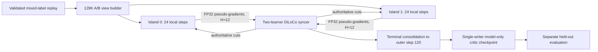

# Qwen3.8-27B 128K value-pretraining DiLoCo diagnostic

Status date: 2026-09-01 UTC

This document hands off the matched-shape DiLoCo diagnostic work for
Qwen3.8-27B value pretraining. It records the implemented 128K topology, the
run that was completed far enough to produce an authoritative critic, the
memory failures and recovery, and the evidence required for the next
comparison.

The diagnostic does **not** establish that DiLoCo is the cause of the lower
explained variance (EV). The available no-DiLoCo reference used different
replay data and a different 262K topology. A matched 128K no-DiLoCo run is
still required for a causal A/B conclusion. No held-out EV was run for this
diagnostic; all EV values below are pooled training-replay metrics.

## Scope and branch contract

The implementation spans two repositories:

- Yeto owns deterministic A/B replay construction, topology and resource
  gates, learner launch, DiLoCo synchronization, anchor spilling, terminal
  consolidation, and offline validation launch support.
- Miles owns model-only critic checkpoint semantics, trained value-head
  preservation on warm load, and rejection of optimizer resume from an
  optimizer-free artifact.

Review branches:

- Yeto: [`fix/qwen38-value-diloco-128k-diagnostic`](https://github.com/agentenv/yeto/tree/fix/qwen38-value-diloco-128k-diagnostic)
- Miles: [`fix/qwen38-value-diloco-128k-diagnostic`](https://github.com/agentenv/miles-values/tree/fix/qwen38-value-diloco-128k-diagnostic)
  at `6438fe22d5915c5b60aa81686e854b66ebe6506c`

The Yeto launchers pin both an exact Miles Git revision and a SHA-256 contract
over the Miles files they depend on. A clean deployment therefore requires
both branches; it must not use an uncommitted Miles checkout.

## Diagnostic architecture

Learner layout:

| Setting | Value |
| --- | --- |
| Model | Qwen3.8-27B, BF16, full-parameter critic |
| Context | 131,072 tokens |
| Islands | 2 independent learners |
| GPUs per island | 4 H200 |
| Parallelism | TP4 / CP1 / PP1 / DP1 |
| Local optimizer steps | 24 per island |
| Total local-update budget | 48 |
| DiLoCo interval | H=12 |
| Optimizer state | Full CPU offload through HDO |
| Checkpoint policy | Model weights only; learner 0 is the sole writer |

Syncer layout:

| Setting | Value |
| --- | --- |
| Roster/quorum | 2 learners, fixed roster, full quorum |
| Representation | 96 fragments, two-fragment pipeline |
| Aggregation | Equal learner weighting |
| Outer update | HeLoCo, LR 0.7, momentum 0.9 |
| Decomposition | Exact Torch SVD on 2 H200s |
| Authoritative state | FP32 parameters and momentum |

This is offline value pretraining. There are no rollout or inference workers
in this job.

## Implemented changes

### Matched 128K A/B replay

`scripts/build_miles_value_128k_ab_views.py` constructs:

- one 48-step no-DiLoCo baseline view; and
- two 24-step DiLoCo island views.

They come from the same eligible source union and preserve samples, labels,
atomic compaction-thread groups, and semantic hashes. The builder checks
mixed-label coverage and H-window balance so a length-sorted label regime
cannot silently recur. This diagnostic builder deliberately selects a bounded
64-bucket subset and is not a general production data scheduler.

### Four-GPU 27B learner

The production learner launcher now has an explicit diagnostic mode for
TP4/CP1 at 128K. It supports either a single no-sync learner or the two-learner
DiLoCo roster and fails closed on mismatched model, topology, data, revision,
memory, disk, or checkpoint contracts.

The 27B optimizer is fully CPU-offloaded. Gradients are transferred one
parameter buffer at a time so GPU memory does not also retain a dense optimizer
view. A missing or malformed distributed gradient fails before optimizer
mutation rather than reusing stale state.

### Bounded anchor and checkpoint memory

The DiLoCo anchor is spilled as exact BF16 shards on local NVMe instead of
remaining as a second dense in-memory model. Value-head tensors use an average
merge rule rather than an Iso matrix transform.

Only learner 0 writes the terminal model-only checkpoint. The artifact carries
an explicit marker, can be loaded for inference or held-out evaluation, and
cannot be mistaken for a resumable optimizer checkpoint.

### Syncer recovery

The original Rust checkpoint loader read the entire approximately 205 GB
checkpoint into one `Vec` before allocating live FP32 parameters and momentum.
That transient allocation exceeded the approximately 334 GiB syncer host RAM.

The loader now:

1. validates the fixed header and preflights the parameter-plus-momentum size;
2. streams the checkpoint through an 8 MiB scratch buffer;
3. preserves checksums, trailer validation, and exact EOF checks; and
4. leaves live state untouched if any read or validation fails.

This bounded loader restored the real 205 GB checkpoint on the existing host
at approximately 191.5 GiB RSS, leaving about 132.6 GiB available.

### Optimizer-free held-out loading

Offline validation can load the model-only critic with `optimizer=None`.
Evaluation no longer creates a fake near-zero-learning-rate optimizer merely
to satisfy the replay path. The current validation launcher still encodes the
older 262K five-island layout, so a 128K two-island held-out launcher must be
prepared before claiming matched held-out EV.

## Run chronology and recovery

1. Both 24-step learners completed their local budgets closely enough to
   produce 47 logged optimizer batches: all 24 from learner 0 and 23 from
   learner 1.
2. The normal phase-one syncer checkpoint at outer step 24 was written. Its
   size was 204,998,891,593 bytes.
3. The first terminal-consolidation attempt failed while restoring that state
   because the old loader's whole-file allocation exceeded host RAM.
4. The bounded streaming loader was implemented, tested, rebuilt, and used to
   resume terminal phase two without repeating learner training.
5. Terminal consolidation reached outer step 120/120. The final approximately
   205 GB syncer checkpoint and `state.ckpt.final` marker were written.
6. Learner 0 installed the authoritative terminal cut and wrote a valid
   approximately 48 GB model-only critic checkpoint at local iteration 23.
7. Learner 1 was killed by Ray's host-memory threshold at approximately 95.3%
   during finalization. It did not write a second checkpoint or its final local
   metric. Learner 0's authoritative model checkpoint remains valid, but the
   two-learner job did not exit cleanly.

The exact run processes were stopped after evidence collection. Learner and
syncer GPUs were idle at shutdown. Small logs, manifests, checksums, markers,
and checkpoint metadata were captured locally; the approximately 48 GB model
checkpoint and approximately 205 GB syncer checkpoint were not copied.

## Results

EV is recomputed from pooled sufficient statistics. It is not an arithmetic
average of per-bucket EV, which would be invalid when bucket target variances
differ.

### 128K two-island DiLoCo diagnostic

| Slice | Pooled train EV |
| --- | ---: |
| All available batches, 47 total | 0.005753 |
| First H=12 window, both learners | 0.000927 |
| Later available H window | 0.013736 |
| Learner 0, all 24 batches | 0.006411 |
| Learner 1, all 23 batches | 0.004398 |

Learner 0's value loss decreased from approximately 3.9 to 1.982. Learner 1's
decreased from approximately 3.9 to 2.169 at its last logged step. The positive
but small pooled EV shows weak training-replay discrimination, not a strong
learning result.

### Available no-DiLoCo reference

The older run completed 48 training steps at 262K with TP4/CP2. Its optimizer
checkpoint save later exceeded host RAM, but its sufficient training statistics
are usable:

| Slice | Pooled train EV |
| --- | ---: |
| All 48 batches | 0.038449 |
| First H=12 window | 0.001248 |
| Final H=12 window | 0.119718 |

The old baseline's mean target was approximately 0.390, while the 128K DiLoCo
diagnostic's was approximately 0.573. The replay distributions and context
topologies therefore differ materially. The lower DiLoCo number is a warning,
not proof that DiLoCo caused the degradation.

## Interpretation

- The 4-GPU TP4/CP1 27B learner path fits and performs optimizer steps with CPU
  offload and bounded gradient/anchor memory.
- The two-island DiLoCo transport, quorum, outer updates, durable state, resume,
  and terminal consolidation all executed on the real 27B state.
- The terminal state can be installed and saved as an optimizer-free critic.
- Training EV is substantially lower than the unmatched 262K baseline.
- Held-out EV is unknown.
- Learner finalization still needs a lower-memory or higher-headroom process
  envelope if both learners are required to acknowledge cleanly.

## Required next comparison

Run the generated **128K no-DiLoCo 48-step view** with the same:

- source sample union and labels;
- Qwen3.8-27B initialization and 51-bin HL-Gauss value head;
- TP4/CP1 topology and 128K context;
- optimizer, learning-rate schedule, and local-update budget; and
- pooled sufficient-statistic evaluation.

Save model weights only. Compare all-48 and final-H pooled train EV against the
numbers above, then run a matched held-out evaluation if the critic will be
used downstream. That A/B isolates synchronization from replay and topology;
the existing 262K reference cannot.

## Verification checklist

The handoff branches passed:

- 139 focused Yeto tests for the 128K builder, launch contracts, HDO gradient
  streaming, anchor spill, and Miles island integration;
- 121 Rust syncer tests, including bounded checkpoint restoration and
  no-mutation-on-error cases;
- 6 companion Miles model-only checkpoint tests;
- shell syntax, Python compile, Rust formatting, Black/Ruff on the new Miles
  checkpoint module and test, and `git diff --check`.

Run-specific evidence additionally includes the phase-one checkpoint marker,
terminal `state.ckpt.final`, learner-0 model-only marker, tracker metadata, both
learner logs, syncer cutoff/finalization logs, and event/manifest records.
