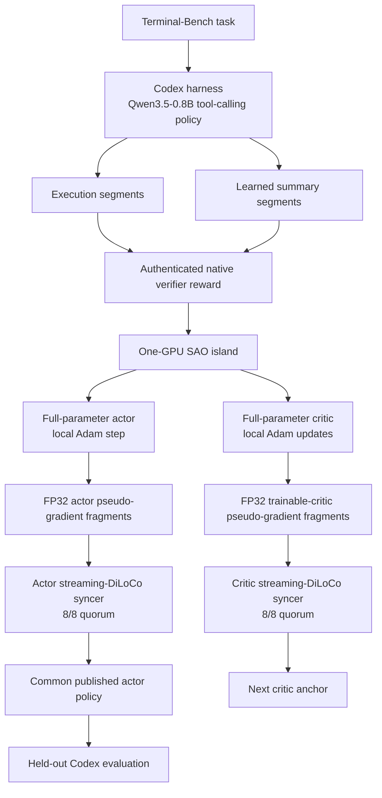

# Qwen3.5-0.8B Terminal-Bench 2.1 SAO + Streaming DiLoCo Validation

Date: 2026-08-26
Release branch: `feat/sao-tbench21-e2e-validation`
Repositories: `agentenv/miles` and `agentenv/yeto`

## Status

The production-shape pipeline completed end to end on one 8×H200 node:

1. an authenticated four-rollout baseline over all Terminal-Bench 2.1 tasks;
2. critic value pretraining from a Qwen3.8-27B teacher trace for every task;
3. learned trajectory compaction;
4. full-parameter SAO actor and critic updates on eight one-GPU islands;
5. separate full-quorum actor and critic streaming-DiLoCo synchronization;
6. publication of one common actor policy; and
7. four-rollout held-out evaluation on the 45-task evaluation split.

Baseline collection accepted 356/356 rollouts, online training accepted 176/176
trajectories, and held-out evaluation accepted 180/180 rollouts. All eight training
islands exited successfully, produced finite actor/critic metrics, reached both
DiLoCo fragment barriers, and published the same terminal actor policy hash.

The evaluation found one success in 180 rollouts. This validates the system path,
not learning quality: the baseline and online-training rewards were all zero, the
training budget was one actor step per island, and 1/180 is not a statistically
meaningful improvement over the all-zero baseline.

## Requested shape

| Requirement | Validated result |
| --- | --- |
| Full Terminal-Bench 2.1 | 89/89 tasks represented |
| Half training / half evaluation | deterministic 44-task train and 45-task held-out split |
| Four rollouts per challenge | baseline 356, training 176, evaluation 180 |
| Codex harness | Codex CLI 0.145.0, `xhigh` reasoning |
| Approximately 0.7B model | `Qwen/Qwen3.5-0.8B` |
| Learned compaction | enabled; model-generated summaries are part of the trajectory |
| Value pretraining on all tasks | teacher dataset covers 89/89 tasks |
| 30-minute maximum episode time | 1,800 seconds |
| Concurrency of at least 300 when possible | server and baseline capacity 304; train/eval contain only 176/180 jobs |
| DiLoCo | separate actor and critic streams, fixed 8/8 quorum, `H=1` |
| One GPU per island | eight independent one-GPU islands |

## Architecture



Each of the eight sibling containers owns one H200 and an independent Ray runtime.
The island colocates a TP1 SGLang engine, a full actor, and a full critic by
offloading components when they are inactive. Actor-to-critic value/log-probability
transfer uses a standalone Gloo process group and CPU wire tensors. This is
intentional: actor and critic are independent singleton Megatron worlds on the
same physical GPU, so a second NCCL communicator would report duplicate GPU use.

The actor and critic do not share one synchronization transaction. They publish
to distinct syncers, on ports 29400 and 29401, with identical fixed-roster and
full-quorum rules. A policy is complete only after both actor fragments have been
accepted and the terminal actor publication is available.

## Immutable inputs and provenance

| Item | Identity |
| --- | --- |
| Policy model | `Qwen/Qwen3.5-0.8B` |
| Model revision | `2fc06364715b967f1860aea9cf38778875588b17` |
| Terminal-Bench revision | `7131e4375048a0e408a8fb404b5f499d726b695b` |
| Runtime image | `yeto-sao-tbench21-runtime:20260826` |
| Runtime image ID | `sha256:69be75252eea4179ccae554f362351a7502f365a89c99eaca322df19f4e55572` |
| Codex binary | `codex-cli 0.145.0` |
| Codex binary SHA-256 | `a2a05dafaa1acb002a45eaec0a462de5b13694fcfcd7bc43305f14781ce7be14` |
| Codex reasoning | `xhigh` |
| Plan manifest SHA-256 | `cd951cd6365fbbf15d67d92add39187108905bc4bfbb8f399a069ae930813c5c` |
| Split SHA-256 | `c3e5abde12dfae025f161dff927dfcc16b8f04e3aa77f7b95256ebbac20b85a8` |
| Task inventory SHA-256 | `f3bbf6f7a5eae0505bcaf8b9587b7691dd7cfbd98e5b2c1cb60b83f1fc86f8df` |
| Final runtime contract SHA-256 | `a07bbc21cd765e8b0f06370eb263337d29d2b9b021726305f694317f95aa007e` |
| Training contract SHA-256 | `8ae08c7f99ecee4167beb843b88547f36d61ad5bc978945dfd4703191baed5ae` |
| Semantic profile SHA-256 | `418a0be25db31c1d41cdee2fcbc55840e9aa8c24b74f502590898c236254c464` |

The deterministic split uses `sha256-domain-ranked-first-44` with seed
`tbench21-sao-20260826`. Per-island seeds are `82621` through `82628`.

The node exposed eight NVIDIA H200 GPUs with 143,771 MiB each. The validation is
a one-node eight-island test. It does **not** establish physical multi-node
Ethernet throughput or operation without InfiniBand across separate hosts.

## Workload and resource shape

| Phase | Tasks | Replicas/task | Logical jobs | Capacity used |
| --- | ---: | ---: | ---: | ---: |
| Baseline | 89 | 4 | 356 | up to 304 simultaneous environments |
| Online training | 44 | 4 | 176 | at most 176 jobs exist |
| Held-out evaluation | 45 | 4 | 180 | at most 180 jobs exist |

Each SGLang engine was configured with:

- TP/PP/CP/EP = 1;
- per-island concurrency 38;
- static memory fraction 0.15;
- maximum total tokens 393,216;
- Mamba cache size 256;
- context length 8,192; and
- response limit 2,048 tokens.

The shared managed Terminal-Bench server was capped at 304 concurrent sandboxes.
This meets the requested 300+ production capacity for the 356-rollout baseline.
Training and evaluation cannot create 300 concurrent episodes because their
complete worklists contain only 176 and 180 jobs.

Forty-four task images were already present. The other 45 were rebuilt from the
Terminal-Bench repository Dockerfiles, and all 45 builds succeeded. The image
build manifest SHA-256 is
`dfe107e71fe3b84172e6b6e1b3028ac75a668454c5762ae4e6c6e0dfe545b06d`.

## Learned compaction contract

Compaction is part of the policy trajectory rather than an external truncation:

- trigger after 6,144 consumed tokens in the 8,192-token context;
- ask the same policy to generate a summary of at most 1,024 tokens;
- allow at most three compactions per trajectory;
- preserve two complete atomic tool steps around each boundary;
- alternate execution and summary segments;
- require a usable trajectory to end in an execution segment;
- copy the final authenticated trajectory reward to every retained segment;
- use per-token loss normalization and dynamic global batching so additional
  compaction events do not give a trajectory extra optimization weight; and
- drop a terminal orphan summary when no later execution segment can consume it.

Observed shapes were:

| Phase | Logical trajectories | Total segments | Compaction events |
| --- | ---: | ---: | ---: |
| Baseline | 356 | 504 | 74 |
| Online training | 176 | 260 | 42 |
| Held-out evaluation | 180 | 238 | 29 |

## Reward and sandbox integrity

The reward path uses Terminal-Bench's native verifier. A run accepts an outcome
only when its task identity, replica identity, native evaluation evidence, and
HMAC signature agree. The HMAC key is supplied as a read-only file and is never
written to a manifest, log, command result, or repository.

The managed OpenEnv server labels task containers with both the exact run ID and
`miles.tbench21.managed=true`. It refuses to create new work after a teardown
failure, performs bounded exact-scope cleanup, and reports active sessions,
managed containers, and orphans through `/miles/managed-status`. It never sweeps
containers outside the two-label run scope.

The final baseline, training, and evaluation waves recorded no HMAC failures, no
503 retries, no infrastructure replacements, and no managed-DinD cleanup debt.
Completed signed rewards of zero are valid model outcomes; unsigned, malformed,
or infrastructure-aborted episodes are not training data.

## Value pretraining

Two value datasets were validated, but only the teacher dataset initialized the
online critic.

### Authenticated 0.8B baseline conversion

- 356 logical trajectories and 504 segments;
- 584,728 active tokens;
- all 356 outcomes authenticated;
- all rewards zero;
- manifest SHA-256
  `d2f084daa1b36713a9b2dea46548251f1498a4d22373efbde976f67f19eabc64`;
- report SHA-256
  `fec225a416c0f78e51e66cc2c5b5d8252fe8d93b91d54accc56187e8d1d12695`.

This conversion proves that the new Codex/compaction format is consumable, but
an all-zero dataset cannot teach useful reward discrimination and was not used as
the online critic checkpoint.

### Qwen3.8-27B teacher dataset used by the critic

- one trace for every one of the 89 tasks;
- 35 positive and 54 zero-reward traces;
- 314,902 active tokens and 4,083 tool calls;
- source model `Qwen/Qwen3.8-27B`;
- Codex 0.146.0 with `xhigh` reasoning;
- 51-bin HL-Gauss classification over reward range `[0, 1]`;
- one epoch, global batch size 1, 89 optimizer steps;
- no repeated or dropped samples;
- first logged loss/accuracy: 5.8320226669 / 0.0489078835;
- last logged loss/accuracy: 1.0629353523 / 0.7692307830;
- dataset SHA-256
  `202014ff125a2ba89d3dc3113948429b6d2d5a03624b54e1d62a0bb9ae8ca092`;
- manifest SHA-256
  `8be9f2b06d65711bccb0a2c06466551126e460a0b4eb812a86df0ae0fddb669f`;
- critic contract SHA-256
  `129c298786c54c8b43d3f69d61f0f518e89ea3ae9ef38a943097e7cbfffff98d`.

The resulting iteration-89 checkpoint contains five files totaling
1,505,655,153 bytes. Raw checkpoint preflight counted 752,393,024 actor scalars,
284 actor tensors, 286 critic tensors, 18 FP32 Qwen GDN `A_log` tensors, and 320
Hugging Face text tensors.

Teacher caveats are important: these are legacy unsigned outcomes, tools were not
present in the ATIF metadata even though tool-call structure was retained, and two
tasks required native-session fallback. The teacher set meets 100% task coverage,
but it has one trace per task, not four. Its decreasing training loss does not by
itself measure held-out critic quality.

## Online SAO recipe

| Setting | Value |
| --- | --- |
| Objective | `sao_dis` |
| Advantage estimator | observation-skipping, length-adaptive GAE |
| SAO alpha | 1.5 |
| Gamma | 1.0 |
| Critic lambda | 1.0 |
| Critic updates per batch | 2 |
| Critic attention | frozen |
| Coding DIS band | lower 0.8, upper 3.0 |
| Actor learning rate | `1e-6` |
| Critic learning rate | `5e-6` |
| Critic warmup | 10 iterations |
| Adam betas | 0.9, 0.98 |
| Weight decay | 0 |
| KL coefficient | 0 |
| Entropy coefficient | 0 |
| Episode timeout | 1,800 seconds |
| Maximum turns | 40 |

Each island receives 22 immutable training trajectories. It performs one actor
optimizer step and two critic optimizer updates. Local training is BF16 with FP32
marked parameters and FP32 external update streams. Actor-to-critic bootstrap
loads every compatible backbone tensor strictly and excludes only the freshly
initialized critic output head.

## Streaming-DiLoCo contract

| Setting | Actor | Critic |
| --- | --- | --- |
| Port | 29400 | 29401 |
| Learners / quorum | 8 / 8 | 8 / 8 |
| Local interval | `H=1` | `H=1` |
| Fragments / pipeline stages | 2 / 2 | 2 / 2 |
| Maximum base lag | 0 | 0 |
| Delta semantics | local minus raw anchor | local minus raw anchor |
| Outer learning rate | 0.7 | 0.7 |
| Outer momentum | 0.9 | 0.9 |

Every fragment is profile-bound and checkpointed. Both roles received 8/8
responders for both fragments, with terminal versions `[1, 2]` and no stale
updates. Because critic attention is frozen by the SAO recipe, the critic stream
carries all trainable critic parameters rather than claiming that frozen tensors
were optimized.

Final synchronized states:

| Role | Bytes | SHA-256 | Fragment-1 delta norm | Fragment-2 delta norm |
| --- | ---: | --- | ---: | ---: |
| Actor | 3,009,572,116 | `44a1e5dcd42851d8f6e81510009b4983334c696c817bd9e05e84f5d521586b80` | 0.00967226746 | 0.00620559459 |
| Critic | 2,074,394,848 | `ad25c174037365d1fd8ab23bbacc4b61c044119cee0f4669f979256650371a06` | 0.00720269750 | 0.00100820191 |

The syncer launch manifest SHA-256 is
`abfae6eb113be0d927e2d17fbe16d4141351514a09766708ed718363e747f6f1`;
the syncer binary SHA-256 is
`144b5a4fbe07a0685b2c19557ba6b93b6407fb7a4182503f77285fa704374d16`.

## How to run the pipeline

The commands below show the intended orchestration. Use new output directories
and run IDs on every launch. Do not reuse a prior manifest path, and do not put
the reward key itself on the command line.

### 1. Pin inputs and build the plan

```bash
export TB_MILES_ROOT=/root/miles
export TB_YETO_ROOT=/root/yeto
export TB_TASKS_DIR=/data/sft/terminal-bench-2
export TB_MODEL_DIR=/data/models/Qwen3.5-0.8B
export TB_PLAN_DIR=/data/sft/sao-qwen35-08b/data/tbench21-sao-full/plan-next
export TB_RUN_ROOT=/data/sft/sao-qwen35-08b/runs/tbench21-sao-full
export TB_CODEX_DIR=/data/sft/sao-qwen35-08b/codex-0.145.0
export TB_REWARD_KEY_FILE=/data/sft/sao-qwen35-08b/secrets/reward-hmac.key

python "$TB_YETO_ROOT/tools/probes/build_tbench21_sao_diloco_plan.py" \
  --tasks-dir "$TB_TASKS_DIR" \
  --output-dir "$TB_PLAN_DIR" \
  --split-seed tbench21-sao-20260826 \
  --run-root "$TB_RUN_ROOT"

python "$TB_MILES_ROOT/tools/probes/build_tbench21_missing_images.py" \
  --tasks-dir "$TB_TASKS_DIR" \
  --output-dir /data/sft/sao-qwen35-08b/image-build-next \
  --workers 8
```

Verify the emitted manifest hashes before proceeding. The plan owns the exact
task/replica roster and deterministic split; later launchers fail closed when the
roster, model identity, or paths drift.

### 2. Start and preflight the managed environment service

```bash
ulimit -n 1048576
export TB_SERVER_RUN_ID=tbench21-sao-next
TB2_TASKS_DIR="$TB_TASKS_DIR" MAX_CONCURRENT_ENVS=304 \
  python "$TB_MILES_ROOT/examples/experimental/openenv/managed_tbench21_server.py" \
    --port 8003 --run-id "$TB_SERVER_RUN_ID"
```

From another shell:

```bash
python "$TB_MILES_ROOT/examples/experimental/openenv/preflight_tbench21_shared_server.py" \
  --url http://127.0.0.1:8003 \
  --run-id "$TB_SERVER_RUN_ID"
```

The preflight requires zero starting residue, creates and evaluates a real task,
tears it down, and requires the exact run scope to return to zero.

### 3. Collect the authenticated baseline

Use the 8- and 64-episode gates when validating a new runtime. They can be omitted
only when the exact image/model/contracts have already passed and the operator
accepts the larger fail-fast wave.

```bash
python "$TB_MILES_ROOT/tools/probes/launch_tbench21_baseline_ramp.py" launch \
  --gate-size 8 \
  --run-id baseline-gate8-next \
  --server-run-id "$TB_SERVER_RUN_ID" \
  --miles-root "$TB_MILES_ROOT" \
  --yeto-root "$TB_YETO_ROOT" \
  --model "$TB_MODEL_DIR" \
  --checkpoint "$TB_MODEL_DIR" \
  --plan-dir "$TB_PLAN_DIR" \
  --output-root "$TB_RUN_ROOT/baseline-gate8-next" \
  --codex-dir "$TB_CODEX_DIR" \
  --hmac-key "$TB_REWARD_KEY_FILE"
```

The full baseline uses the production launcher:

```bash
python "$TB_MILES_ROOT/tools/probes/launch_tbench21_rollout_wave.py" \
  --phase baseline \
  --miles-root "$TB_MILES_ROOT" \
  --yeto-root "$TB_YETO_ROOT" \
  --model "$TB_MODEL_DIR" \
  --checkpoint "$TB_MODEL_DIR" \
  --plan-dir "$TB_PLAN_DIR" \
  --output-root "$TB_RUN_ROOT/baseline-next" \
  --codex-dir "$TB_CODEX_DIR" \
  --hmac-key "$TB_REWARD_KEY_FILE"
```

Run `postcheck_tbench21_baseline_wave.py` against the generated launch manifest
before converting any trajectories. The postcheck verifies the exact 89×4 roster,
HMACs, unique task/replica ownership, native evaluation evidence, compaction
structure, and managed-server cleanup.

### 4. Build the teacher value dataset and pretrain the critic

```bash
python "$TB_MILES_ROOT/tools/probes/build_tbench21_qwen38_teacher_value_dataset.py" \
  --source-root /data/sft/qwen38-teacher-rollouts \
  --expected-plan-manifest "$TB_PLAN_DIR/manifest.json" \
  --target-tokenizer "$TB_MODEL_DIR" \
  --target-chat-template "$TB_MODEL_DIR/chat_template.jinja" \
  --output-dir /data/sft/sao-qwen35-08b/data/value-teacher-next

bash "$TB_MILES_ROOT/tools/probes/run_sao_qwen35_08_value_pretrain.sh"
```

The value launcher is deliberately pinned to Qwen3.5-0.8B and validates the
dataset, critic contract, actor bootstrap, iteration count, and output checkpoint.
Run `check_sao_qwen35_raw_checkpoints.py` before online training.

### 5. Build contracts and start both syncers

`build_tbench21_sao_streaming_contracts.py` is a four-stage builder:
`probe-context`, `profile`, `prepare`, and `finalize`. It binds the plan, reward
source, value-checkpoint contract, container-visible paths, training semantics,
syncer endpoints, and binary attestation. Each stage consumes the previous
stage's immutable artifact; do not hand-edit the JSON between stages.

After finalization:

```bash
python "$TB_YETO_ROOT/tools/probes/launch_tbench21_sao_syncers.py" \
  --contracts /data/sft/sao-qwen35-08b/contracts/next \
  --binary /root/yeto/target/release/yeto \
  --run-dir "$TB_RUN_ROOT/syncers-next"
```

Wait for both ports and verify their health/profile identities before allocating
the learner containers.

### 6. Launch the eight-island online wave

```bash
python "$TB_MILES_ROOT/tools/probes/launch_tbench21_sao_online_wave.py" \
  --miles-root "$TB_MILES_ROOT" \
  --yeto-root "$TB_YETO_ROOT" \
  --model "$TB_MODEL_DIR" \
  --actor-checkpoint /data/sft/sao-qwen35-08b/checkpoints/actor-bootstrap \
  --critic-checkpoint /data/sft/sao-qwen35-08b/checkpoints/value-teacher-next \
  --plan-dir "$TB_PLAN_DIR" \
  --contracts-dir /data/sft/sao-qwen35-08b/contracts/next \
  --syncer-launch-manifest "$TB_RUN_ROOT/syncers-next/launch-manifest.json" \
  --output-root "$TB_RUN_ROOT/online-next" \
  --codex-dir "$TB_CODEX_DIR" \
  --hmac-key "$TB_REWARD_KEY_FILE"
```

The launcher fails before work starts unless it can prove eight distinct GPU
assignments, exact plan coverage, checkpoint compatibility, contract hashes,
reward-key permissions, syncer identities, memory caps, and zero conflicting
managed-server state. During the run, monitor container exit/OOM state, learner
logs, syncer fragment/quorum state, and managed-server residue.

### 7. Evaluate the published actor

Use the terminal actor checkpoint read-only and a fresh output directory:

```bash
python "$TB_MILES_ROOT/tools/probes/launch_tbench21_rollout_wave.py" \
  --phase eval \
  --miles-root "$TB_MILES_ROOT" \
  --yeto-root "$TB_YETO_ROOT" \
  --model "$TB_MODEL_DIR" \
  --checkpoint "$TB_RUN_ROOT/online-next/island-7/actor-checkpoint" \
  --plan-dir "$TB_PLAN_DIR" \
  --output-root "$TB_RUN_ROOT/heldout-eval-next" \
  --codex-dir "$TB_CODEX_DIR" \
  --hmac-key "$TB_REWARD_KEY_FILE"
```

Finally run `postcheck_tbench21_eval_wave.py`. It requires the expected plan SHA,
terminal actor policy hash, checkpoint inventory SHA, training launch manifest,
exact 45×4 evaluation roster, 180 valid signed native outcomes, valid compaction
chains, and a clean managed environment service.

## Validation ladder and saved-batch evidence

The production launch followed this fail-closed sequence:

1. deterministic task plan and split;
2. 89/89 task images available;
3. exact runtime, model, Codex, and source attestations;
4. managed-server capacity and cleanup;
5. authenticated baseline collection;
6. compaction conversion and schema validation;
7. teacher critic pretraining;
8. raw actor/critic checkpoint compatibility;
9. saved-batch critic update;
10. actor/critic value transfer;
11. actor optimizer step;
12. bidirectional two-process Gloo transfer;
13. actor/critic syncer quorum and publication;
14. full 176-trajectory online wave; and
15. strict 180-rollout held-out evaluation.

Before relaunching the production wave, a saved completed rollout batch exercised
the remaining training boundary without recollecting rollouts:

| Metric | Observed value |
| --- | ---: |
| Critic loss | 3.9318247634 → 1.2144285313 |
| Actor values | 0.1596418023 |
| Advantages | -0.1203074455 |
| Returns | 0.0393343568 |
| Actor loss | -0.0314317429 |
| Actor gradient norm | 0.7331610322 |
| PPO KL | 0.003178218 |

All values were finite and the input batch checksum remained unchanged.

## Production results

### Baseline

- eight containers exited 0 with no OOM;
- approximately 13 minutes wall time;
- 356/356 logical trajectories and signed outcomes;
- 89 tasks × four replicas;
- 504 segments and 74 compactions;
- status counts: 4 completed, 232 `max_seq_len`, 120 `max_turns`;
- 0 HMAC failures, 0 503 retries, 0 replacements; and
- 0/356 successful rollouts.

Strict baseline report SHA-256:
`e178a291f0b2a7f065bbb1d8e2cbd03c935e6e3831ef935cf2547a725a96a86a`.

### Online training

- eight containers exited 0 with no OOM;
- approximately 38 minutes wall time;
- 176/176 immutable logical trajectories across 44 tasks;
- 260 segments, 42 compactions, and 310,686 active tokens;
- status counts: 4 completed, 123 `max_seq_len`, 49 `max_turns`;
- all 176 rewards were authenticated zeros;
- one actor step and two critic updates per island;
- all eight actor and critic checkpoints saved;
- both syncers reached 8/8 quorum for both fragments; and
- all islands published terminal actor policy hash
  `c79f85ac812e5bc107682467b5bd266c7776b5aff13138f5a7faa0950135ca02`.

| Metric | Across eight islands |
| --- | --- |
| Actor loss | -0.0255213 to -0.0190217 |
| Actor gradient norm | 0.609504 to 0.847301 |
| PPO KL | 0.000504741 to 0.00526865 |
| Effective sample size | 0.989259 to 0.999037 |
| Critic value loss | 1.156619 to 1.262702 |
| Critic gradient norm | 38.0985 to 51.5822 |
| Critic accuracy | 0.564855 to 0.646614 |

The initial behavior-policy hash was
`8f5faa519b97928df2cf143a3bbc6f25e3cd7fccfade61824359c12766a2f358`.
The online launch manifest SHA-256 was
`957dc7792bc79c393216d4f11b02088cb6577317dca6b5ddf4e766e90a2f0f57`.

### Held-out evaluation

- approximately 13 minutes wall time;
- eight containers exited 0 with no OOM;
- 180/180 expected rollouts across 45 tasks × four replicas;
- 180/180 valid HMAC outcomes and native verifier evaluations;
- 238 segments and 29 compactions;
- status counts: 7 completed, 116 `max_seq_len`, 57 `max_turns`;
- 0 503 errors, 0 replacements, and 0 cleanup debt;
- 1/180 rollout success = 0.5556%; and
- 1/45 task pass@4 = 2.2222%.

The one success was `password-recovery`, replica 3. The evaluation mounted
`online/island-7/actor-checkpoint` read-only; its eight-file inventory totaled
1,505,557,988 bytes and had SHA-256
`99eefeb8a734e70e05c78617f987e9ac1e4bad6bbe83d2b1ccd83c01f048f208`.
The strict evaluation report SHA-256 was
`63290b0c4ab234e88a8c635e4870cb136d6152c7f7fde93cf26a8e8ba563af6d`.

Raw distributed-checkpoint hashes can differ by island because optimizer, RNG,
and island-local state are included. The common published policy hash is the
relevant policy-identity proof.

## Failures found and permanent fixes

| Failure | Root cause | Fix and evidence |
| --- | --- | --- |
| 45 tasks initially unrunnable | task images were absent locally | rebuilt from repository Dockerfiles; 45/45 succeeded |
| unsigned/malformed outcomes and 503 leakage | unmanaged session failure and loose acceptance | exact-scope managed lifecycle, native-evidence/HMAC acceptance, capacity gates, and strict cleanup checks; final waves had none |
| malformed compaction endings | summaries could become terminal or chains could merge inconsistently | alternating segment invariants, orphan-summary drop, reward consistency, and compaction-aware merge/training weights |
| missing initial policy token | initial snapshot identity could be `None` | concrete version/hash propagation is required before rollout |
| SGLang resume OOM | KV/cache reservation was too aggressive after trainer offload | memory fraction 0.15, max tokens 393,216, Mamba cache 256, and explicit offload sequencing |
| allocator failure | TorchMemorySaver rejected expandable-segment mode | disabled the incompatible allocator mode in the colocated path |
| incomplete FP32 master coverage | a Qwen marked parameter did not map to a complete optimizer master | fail-closed full-parameter coverage checks and the validated DP1 optimizer layout prevent launch with partial masters |
| actor/critic NCCL duplicate GPU | two independent singleton worlds opened NCCL on one device | standalone Gloo group with CPU staging |
| NaNs after first Gloo change | critic used default-world rank and broadcast an uninitialized buffer | use `group.rank()` for the custom group; saved-batch and production values remained finite |
| critic bootstrap mismatch | actor checkpoint has no critic output head | strict backbone load while excluding exactly the fresh critic head |
| late evaluation ambiguity | roster, identity, or cleanup drift could be missed | strict postcheck binds roster, HMAC, native evidence, checkpoint provenance, compaction, and managed cleanup |

## Repository verification

Before release, the Yeto changed-path matrix passed 351/351 tests. New Yeto files
also passed Ruff, and every changed Python file parsed successfully.

The Miles changed-path selection is run inside the exact production image because
the local development environment does not contain SGLang. Release notes should
record its final pass count from the branch CI/test run rather than inferring it
from collection. Independently captured production evidence includes the full
356-rollout baseline, finite saved-batch training boundary, 176-trajectory online
wave, both 8/8 syncers, and 180-rollout strict held-out postcheck.

## Limitations

- The baseline and all online-training rewards were zero. SAO received no positive
  online reward signal in this short run.
- The one held-out success is not statistically significant evidence of learning.
- The teacher critic outcomes are legacy and unsigned.
- Teacher pretraining used one trace per task, while the baseline used four.
- Twenty-three held-out traces had a narrowly allowed terminal token mismatch:
  signed zero reward, `max_seq_len` or `max_turns`, and a missing final
  `<|im_end|>`. Broader mismatches are rejected. One terminal orphan summary was
  dropped under the compaction contract.
- An exploratory training count found 26 analogous nonempty terminal mismatches;
  unlike evaluation, no standalone formal training postcheck report was saved for
  that count.
- The policy hash is bound to the publication contract; evaluation did not
  independently re-hash every model tensor.
- This is an eight-island single-node validation, not a physical multi-node test.
- Durable recovery of a dead trainer's model and optimizer state is outside this
  release; the synchronization services themselves remain restart-idempotent.

## Conclusion

The requested production-shape software path works end to end: authenticated
Terminal-Bench rollouts, Codex tool use, learned compaction, critic pretraining,
SAO actor/critic optimization, one GPU per island, full-quorum streaming DiLoCo,
common policy publication, and held-out evaluation all completed without OOM,
runtime exception, reward-authentication failure, 503 leak, or sandbox residue.

This result is strong architecture validation. It is not yet a learning-quality
claim. A meaningful efficacy experiment should use a stronger policy and/or more
online rounds, preserve the same held-out split and signed evaluation ledger, and
report confidence intervals against a matched baseline.
