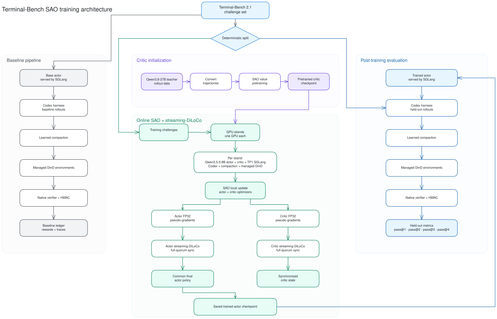

# Qwen3.5-0.8B Terminal-Bench 2.1 SAO + Streaming DiLoCo: End-to-End Validation and Matched Evaluation

Initial run date: 2026-08-26
Corrected evaluation date: 2026-08-27
Feature branch: `feat/sao-tbench21-e2e-validation`
Repositories: `agentenv/miles` and `agentenv/yeto`

## Executive conclusion

The production-shape software path completed end to end on one 8×H200 node:

1. Terminal-Bench 2.1 rollouts through the Codex harness;
2. learned trajectory compaction;
3. authenticated native-verifier rewards in managed DinD environments;
4. offline SAO critic value pretraining;
5. full-parameter SAO actor and critic updates on eight one-GPU islands;
6. independent actor and critic streaming-DiLoCo synchronization;
7. publication of one common trained actor policy; and
8. checkpoint-backed held-out evaluation with four rollouts per task.

The architecture is validated. The trained actor did **not** outperform the
matched base policy. Both policies solved 1 of 180 held-out rollouts, producing
identical pass@1, pass@2, pass@3, and pass@4. The successful task changed, which
shows a behavioral change but not an aggregate improvement.

The critic did learn measurable signal from the mixed-label Qwen3.8-27B teacher
set. Corrected forward-only explained variance was approximately +0.136, with
positive explained variance in seven of eight disjoint batches. This is critic
evidence, not evidence that the actor improved.

The previous revision of this document incorrectly treated a base-Hugging-Face
evaluation as trained-checkpoint evidence. The corrected evaluation loaded the
trained Megatron actor, published it to SGLang on every island, and proved the
served language tensors differed from the base model before accepting the score.

## Architecture artifact



Editable source: [tbench21-sao-architecture.excalidraw](assets/images/tbench21-sao-architecture.excalidraw)

Raster export: [tbench21-sao-architecture.png](assets/images/tbench21-sao-architecture.png)

The diagram includes only implemented architecture. It excludes roadmap items,
proposed recovery work, and superseded evaluation paths.

## Questions answered

This run answers two different questions:

1. **Does the complete SAO + streaming-DiLoCo implementation work at the
   requested production shape?** Yes.
2. **Does this short Qwen3.5-0.8B run improve held-out Terminal-Bench
   performance over the same base policy?** No measurable improvement was
   observed.

Successful systems validation must not be reported as successful policy
learning.

## Validated shape

| Requirement | Validated configuration |
| --- | --- |
| Benchmark | Terminal-Bench 2.1, all 89 tasks represented |
| Split | deterministic 44-task training / 45-task held-out split |
| Rollouts per task | four |
| Actor | `Qwen/Qwen3.5-0.8B` |
| Harness | Codex CLI with `xhigh` reasoning |
| Compaction | policy-generated learned summaries |
| Episode limit | 1,800 seconds |
| Baseline capacity | up to 304 simultaneous managed environments |
| Training topology | eight one-GPU islands on one 8×H200 node |
| Local training | full-parameter actor and critic optimization |
| Synchronization | separate actor and critic streaming-DiLoCo, `H=1`, full quorum |
| Evaluation | matched 45-task roster, four replicas per task |

This was a single-node, eight-island validation. It does not establish physical
multi-node Ethernet performance.

## Architecture and data flow

### Baseline and evaluation

Each rollout used the same semantic path:

1. SGLang served the selected actor policy.
2. Codex drove the Terminal-Bench task and tool calls.
3. The actor generated learned summary segments after the compaction threshold.
4. A managed DinD environment executed the challenge.
5. The native Terminal-Bench verifier produced the outcome.
6. Task identity, replica identity, native evidence, and HMAC were checked before
   the outcome entered the ledger.

Completed signed zero rewards are valid model outcomes. Unsigned,
infrastructure-aborted, malformed, or roster-mismatched episodes are rejected.

### Critic initialization

One Qwen3.8-27B teacher trace for each of the 89 tasks was converted into the
SAO value-pretraining format. A Qwen3.5-0.8B critic was trained for 89 steps with
a 51-bin HL-Gauss objective over reward range `[0, 1]`. The resulting critic
checkpoint initialized the critic on every online island.

### Online SAO and streaming-DiLoCo

Each island owned one H200 and an independent Ray runtime. It colocated a TP1
SGLang engine, a full actor, a full critic, and the Codex/compaction/DinD rollout
path. Each island performed one actor optimizer step and two critic optimizer
updates.

Actor and critic pseudo-gradients were emitted as separate FP32 streams and sent
to independent streaming-DiLoCo syncers with fixed rosters and full quorum. The
common actor state became the trained checkpoint. The synchronized critic
remained training state.

Actor-to-critic value and log-probability transfer used a standalone Gloo group
with CPU wire tensors. The actor and critic are independent singleton Megatron
worlds on the same GPU, so a second NCCL communicator would create a duplicate-
GPU conflict.

## Immutable inputs and provenance

| Item | Identity |
| --- | --- |
| Model revision | `2fc06364715b967f1860aea9cf38778875588b17` |
| Terminal-Bench revision | `7131e4375048a0e408a8fb404b5f499d726b695b` |
| Runtime image | `yeto-sao-tbench21-runtime:20260826` |
| Runtime image ID | `sha256:69be75252eea4179ccae554f362351a7502f365a89c99eaca322df19f4e55572` |
| Codex binary | `codex-cli 0.145.0` |
| Codex binary SHA-256 | `a2a05dafaa1acb002a45eaec0a462de5b13694fcfcd7bc43305f14781ce7be14` |
| Plan manifest SHA-256 | `cd951cd6365fbbf15d67d92add39187108905bc4bfbb8f399a069ae930813c5c` |
| Split SHA-256 | `c3e5abde12dfae025f161dff927dfcc16b8f04e3aa77f7b95256ebbac20b85a8` |
| Task inventory SHA-256 | `f3bbf6f7a5eae0505bcaf8b9587b7691dd7cfbd98e5b2c1cb60b83f1fc86f8df` |
| Runtime contract SHA-256 | `a07bbc21cd765e8b0f06370eb263337d29d2b9b021726305f694317f95aa007e` |
| Training contract SHA-256 | `8ae08c7f99ecee4167beb843b88547f36d61ad5bc978945dfd4703191baed5ae` |
| Semantic profile SHA-256 | `418a0be25db31c1d41cdee2fcbc55840e9aa8c24b74f502590898c236254c464` |

The split used `sha256-domain-ranked-first-44` with seed
`tbench21-sao-20260826`. Island seeds were `82621` through `82628`.

The initial baseline conversion and teacher artifacts bind plan-v2 SHA-256
`48f74ac79a9de776cfc36c370fcc04411e827c7837747192943771282ecd1ad7`;
the final online and evaluation contracts bind plan-v4 SHA-256
`cd951cd6365fbbf15d67d92add39187108905bc4bfbb8f399a069ae930813c5c`.
They use the same task inventory, split, and selection. The version distinction
is retained rather than treating every artifact as if it were generated from
one plan revision.

Forty-four task images were already available. The remaining 45 were rebuilt
from repository Dockerfiles, and all builds succeeded. The image-build manifest
SHA-256 was
`dfe107e71fe3b84172e6b6e1b3028ac75a668454c5762ae4e6c6e0dfe545b06d`.

## Workload and resources

| Phase | Tasks | Replicas/task | Logical trajectories |
| --- | ---: | ---: | ---: |
| Full baseline collection | 89 | 4 | 356 |
| Online training | 44 | 4 | 176 |
| Matched base-policy held-out evaluation | 45 | 4 | 180 |
| Trained-policy held-out evaluation | 45 | 4 | 180 |

Each SGLang engine used TP/PP/CP/EP = 1, per-island concurrency 38, static
memory fraction 0.15, maximum total tokens 393,216, Mamba cache size 256,
context length 8,192, and response limit 2,048 tokens.

The managed service allowed 304 concurrent sandboxes. Training and evaluation
contained only 176 and 180 jobs, so they could not use 300 concurrent episodes.

## Full-task baseline collection

The initial all-task collection accepted all 356 signed rollouts (89 tasks ×
four replicas), comprising 504 segments, 74 compactions, and 584,728 active
tokens. It produced zero successes. Statuses were 232 `max_seq_len`, 120
`max_turns`, and four `completed`.

This collection proves the initial-rollout and data path over the complete task
inventory. It is **not** the matched learning baseline used in the final actor
comparison; that comparison uses the separate 45-task held-out base-policy
evaluation below.

Authoritative report:

- `/data/sft/sao-qwen35-08b/runs/tbench21-sao-full/baseline-v6/postcheck-report.json`
- SHA-256
  `e178a291f0b2a7f065bbb1d8e2cbd03c935e6e3831ef935cf2547a725a96a86a`

## Learned compaction

Compaction was part of the policy trajectory, not external truncation:

- trigger after 6,144 consumed tokens in an 8,192-token context;
- generate at most 1,024 summary tokens with the same actor;
- allow at most three compactions per trajectory;
- preserve two complete atomic tool steps at each boundary;
- alternate execution and summary segments;
- require a reusable training trace to end in an execution segment;
- copy the authenticated final reward to each retained segment;
- normalize per token so more compactions do not increase trajectory weight; and
- discard a terminal orphan summary if no later execution consumes it.

| Phase | Trajectories | Segments | Compactions |
| --- | ---: | ---: | ---: |
| Full baseline | 356 | 504 | 74 |
| Online training | 176 | 260 | 42 |
| Original base-policy held-out evaluation | 180 | 238 | 29 |
| Corrected trained-policy held-out evaluation | 180 | 256 | 38 |

The corrected trained-policy evaluation contained 301,342 active tokens. Its
postcheck records compaction and TITO validity per trajectory instead of
reusing the original aggregate segment claim.

## Critic value pretraining

### Dataset and training

The online critic used the Qwen3.8-27B teacher set, not the all-zero 0.8B
baseline conversion.

- 89 traces: one per benchmark task;
- 35 positive and 54 zero-reward traces;
- 314,902 active tokens and 4,083 tool calls;
- one epoch, global batch size 1, 89 optimizer steps;
- first loss/accuracy: 5.8320226669 / 0.0489078835;
- last loss/accuracy: 1.0629353523 / 0.7692307830;
- dataset SHA-256:
  `202014ff125a2ba89d3dc3113948429b6d2d5a03624b54e1d62a0bb9ae8ca092`;
- manifest SHA-256:
  `8be9f2b06d65711bccb0a2c06466551126e460a0b4eb812a86df0ae0fddb669f`;
- critic contract SHA-256:
  `129c298786c54c8b43d3f69d61f0f518e89ea3ae9ef38a943097e7cbfffff98d`.

The teacher outcomes are legacy and unsigned, and the dataset contains one
trace per task rather than four. Those are provenance limitations.

### Why the original EV was degenerate

Global batch size was 1, and every active token in a trajectory shared one
binary return. The within-batch target variance was therefore zero, so per-step
explained variance was undefined. A logged zero did not mean the critic
explained exactly zero variance; the batch could not support the statistic.

Loss reduction alone was insufficient evidence because it does not show whether
the critic ranks mixed outcomes usefully.

### Corrected mixed-label EV gate

The corrected evaluator loaded the contracted iteration-89 critic and performed
no optimizer initialization or steps. It selected 64 distinct teacher rows as
eight deterministic, disjoint batches of eight, forcing both labels into every
batch. It evaluated two weightings:

- trajectory-weighted: every trajectory contributes equal total weight;
- token-weighted: every active target token contributes equal weight.

| Metric | Trajectory-weighted | Token-weighted |
| --- | ---: | ---: |
| Aggregate explained variance | +0.1365258961 | +0.1352731576 |
| Batches with EV > 0 | 7/8 | 7/8 |
| Active targets | 64 trajectories | 242,242 tokens |
| Gate | passed | passed |

The gate requires aggregate EV > 0 and a strict majority of positive batch EVs
under both weightings.

These 64 rows come from the training manifest rather than held-out critic data.
The gate proves non-degenerate fitted signal; it does not establish critic
generalization. One of eight batches was negative (trajectory-weighted
`-0.0398054731`, token-weighted `-0.0338625173`).

Authoritative report:

- `/data/sft/sao-qwen35-08b/runs/tbench21-sao-full/value-pretrain-teacher-v1/ev-gate-v2/report.json`
- schema `miles.value-pretrain-eval.v2`
- SHA-256
  `51219d6680ebbcc4625c92048ec5dbe964856c91d2ab3117a7d3aaa2103308a8`

This establishes useful critic signal. It does not establish actor improvement.

## Online training result

| Setting | Value |
| --- | --- |
| Objective | `sao_dis` |
| Advantage estimator | observation-skipping, length-adaptive GAE |
| SAO alpha | 1.5 |
| Gamma / critic lambda | 1.0 / 1.0 |
| Actor / critic updates per island | 1 / 2 |
| Actor / critic learning rate | `1e-6` / `5e-6` |
| Adam betas | 0.9, 0.98 |
| Weight decay / KL / entropy coefficient | 0 / 0 / 0 |
| Maximum turns / timeout | 40 / 1,800 seconds |

All 176 online trajectories were accepted: 260 segments, 42 compactions, and
310,686 active tokens. Statuses were four `completed`, 123 `max_seq_len`, and 49
`max_turns`. Every terminal reward was an authenticated zero. The
teacher-pretrained critic supplied learned values, but the online wave contained
no positive terminal reward. This limits what one actor step can learn.

All eight learner containers exited 0 without OOM, saved actor and critic
checkpoints, and reached full quorum for both actor and critic fragments. Every
island attested terminal actor policy hash
`c79f85ac812e5bc107682467b5bd266c7776b5aff13138f5a7faa0950135ca02`.

| Metric | Range across islands |
| --- | --- |
| Actor loss | -0.0255213 to -0.0190217 |
| Actor gradient norm | 0.609504 to 0.847301 |
| PPO KL | 0.000504741 to 0.00526865 |
| Effective sample size | 0.989259 to 0.999037 |
| Critic value loss | 1.156619 to 1.262702 |
| Critic gradient norm | 38.0985 to 51.5822 |
| Critic accuracy | 0.564855 to 0.646614 |

The online launch-manifest SHA-256 was
`957dc7792bc79c393216d4f11b02088cb6577317dca6b5ddf4e766e90a2f0f57`.

### Streaming-DiLoCo evidence

| Setting | Actor | Critic |
| --- | --- | --- |
| Port | 29400 | 29401 |
| Learners / quorum | 8 / 8 | 8 / 8 |
| Local interval | `H=1` | `H=1` |
| Fragments / stages | 2 / 2 | 2 / 2 |
| Maximum base lag | 0 | 0 |
| Outer learning rate / momentum | 0.7 / 0.9 | 0.7 / 0.9 |

| Role | Synchronized bytes | SHA-256 | Fragment 1 norm | Fragment 2 norm |
| --- | ---: | --- | ---: | ---: |
| Actor | 3,009,572,116 | `44a1e5dcd42851d8f6e81510009b4983334c696c817bd9e05e84f5d521586b80` | 0.00967226746 | 0.00620559459 |
| Critic | 2,074,394,848 | `ad25c174037365d1fd8ab23bbacc4b61c044119cee0f4669f979256650371a06` | 0.00720269750 | 0.00100820191 |

Nonzero update norms and changed actor tensors show that training was not a
no-op.

## Corrected checkpoint-backed evaluation

### Original evaluation classification

The original held-out run mounted the trained-checkpoint path but used
`--debug-rollout-only`, which intentionally skipped Megatron actor loading and
publication. SGLang served the base Hugging Face model.

The old run remains a valid matched **base-policy** evaluation because the
45-task roster, four replicas, harness, HMACs, and native outcomes passed. All
rollout weight versions were `default`. It is not trained-policy evidence.

### Publication proof in the corrected run

`--rollout-only-from-checkpoint` instantiates the Megatron actor, loads the
trained checkpoint, publishes it to SGLang, and never trains or saves. Each
island:

1. checksummed the base SGLang language tensors;
2. published the trained actor and required `default → 1`;
3. required at least one tensor to change;
4. snapshotted the trained served state;
5. reset the selected tensors;
6. republished and required `1 → 2`; and
7. required exact equality with the original trained snapshot.

All eight islands agreed on:

- 309 checked language tensors;
- 248 tensors changed from base;
- base checksum
  `a2a43b576573582e778d8617a79f7e99a6586dbe08c81daa2f95ef50669d9f93`;
- trained checksum
  `1f7830029984bb9ed99765c317e618e0a5745f8c444eec226cc4195fdfe9b781`;
- exact reset/republication equality; and
- weight versions `default → 1 → 2`.

This proves the corrected evaluation served the trained actor.

The checkpoint inventory SHA-256 was
`99eefeb8a734e70e05c78617f987e9ac1e4bad6bbe83d2b1ccd83c01f048f208`.

## Base versus trained performance

For each task with `n=4` rollouts and `c` successes, pass@k is

```text
1 - C(n-c, k) / C(n, k)
```

The report averages the per-task values across 45 held-out tasks.

| Metric | Base | Trained | Delta |
| --- | ---: | ---: | ---: |
| Signed rollouts | 180/180 | 180/180 | 0 |
| Successful rollouts | 1/180 | 1/180 | 0 |
| Tasks with success | 1/45 | 1/45 | 0 |
| pass@1 | 0.5556% | 0.5556% | 0.0000 pp |
| pass@2 | 1.1111% | 1.1111% | 0.0000 pp |
| pass@3 | 1.6667% | 1.6667% | 0.0000 pp |
| pass@4 | 2.2222% | 2.2222% | 0.0000 pp |
| Successful sample | `password-recovery:r3` | `portfolio-optimization:r0` | changed |

The trained policy lost the base success and gained a different one. This is a
behavioral change, not a net improvement, and is far too small for a learning-
quality claim.

### Base-policy held-out evidence

- 180/180 signed outcomes;
- status: 7 `completed`, 116 `max_seq_len`, 57 `max_turns`;
- one success: `password-recovery:r3`;
- 23 narrowly approved terminal boundary mismatches;
- no 503 retries, replacements, or cleanup debt;
- launch-manifest SHA-256
  `c31d4bb49984315d6f2981d5aeaeb413b0957ddfa208dd17615eecb325ddec0e`;
- report:
  `/data/sft/sao-qwen35-08b/runs/tbench21-sao-full/heldout-eval-v1/postcheck-report.json`;
- SHA-256
  `63290b0c4ab234e88a8c635e4870cb136d6152c7f7fde93cf26a8e8ba563af6d`.

### Trained-policy held-out evidence

- eight containers exited 0 without OOM;
- 180/180 signed outcomes;
- status: 3 `completed`, 118 `max_seq_len`, 58 `max_turns`, 1 `timeout`;
- 179 native evaluations and one signed timeout outcome;
- one success: `portfolio-optimization:r0`;
- 23 score-valid but trace-ineligible terminal boundary mismatches;
- one soft assistant-text TITO mismatch, 0.56%, below the 20% gate;
- zero active sessions, managed containers, orphans, or cleanup debt;
- launch-manifest SHA-256
  `f119b503c827cd6fee00692704b7a891de51ac82ce9c151fc0e1e31f5b16d812`;
- report:
  `/data/sft/sao-qwen35-08b/runs/tbench21-sao-full/heldout-eval-trained-v2/postcheck-report-v2.json`;
- schema `miles.tbench21-eval-postcheck.v2`;
- SHA-256
  `d898f3bd1432061a327ef7c14fdd3c2e749996f749fecb86ebc06245162c2103`.

The timed-out `fix-ocaml-gc` verifier was stuck in a `git clone` inside its
native test script. The 30-minute episode deadline fired, the verifier process
group was terminated, and the episode closed as a signed zero-reward timeout.

Twenty-three trained-evaluation outcomes had narrowly approved missing-terminal
`<|im_end|>` boundary mismatches. Their signed native scores remain valid, but
the traces are ineligible for training reuse. One
`eval:pytorch-model-recovery:r2` trace had a soft assistant-text TITO mismatch;
its ratio was 1/180 (0.56%), below the 20% gate. The score remained valid because
the actual tokens inherit the pretokenized prefix.

## Interpretation

### Proven

- The full requested software path runs at the eight-island shape.
- Codex, learned compaction, native rewards, HMAC acceptance, and managed DinD
  work together.
- The critic learned positive mixed-label explained variance.
- Actor and critic full-parameter optimizer steps completed with finite values.
- Both streaming-DiLoCo roles reached full quorum.
- The actor checkpoint materially changed from the base model.
- The trained checkpoint was demonstrably served during evaluation.
- Roster, reward, trace, and cleanup postchecks passed.

### Not proven

- The trained actor does not outperform the base actor on this run.
- One success in 180 is not statistically meaningful.
- The run does not isolate model capacity, zero online rewards, the one-step
  budget, critic quality, or their interaction.
- Physical multi-node scaling was not exercised.
- Durable recovery of a dead learner's model and optimizer was not exercised.

The defensible result is: **the implementation worked, model state changed, and
the critic learned signal, but the short 0.8B actor experiment produced no
measurable task-level improvement.**

## Failures found and permanent fixes

| Failure | Root cause | Fix |
| --- | --- | --- |
| 45 tasks unrunnable | missing task images | rebuilt all 45 from repository Dockerfiles |
| unsigned outcomes / 503 leakage | unmanaged lifecycle and loose acceptance | exact managed scope, native evidence, HMAC, and cleanup gates |
| malformed compaction endings | inconsistent summary termination/merge | segment alternation, orphan-summary drop, reward consistency |
| SGLang resume OOM | excessive cache reservation after offload | bounded memory fraction, tokens, Mamba cache, and offload order |
| incomplete FP32 master coverage | marked parameter lacked full optimizer-master mapping | fail-closed full-parameter preflight |
| duplicate-GPU NCCL | actor and critic singleton worlds opened NCCL on one GPU | standalone Gloo group with CPU staging |
| NaNs after initial Gloo work | wrong process-group rank initialized the buffer | use custom group rank; finite saved-batch and production metrics |
| critic bootstrap mismatch | actor checkpoint has no critic output head | strict compatible-backbone load excluding only the new head |
| EV logged as zero | batch size 1 had zero target variance | deterministic mixed-label forward-only EV gate |
| old eval served base weights | debug rollout mode skipped actor publication | checkpoint-backed rollout mode and tensor/version proof |
| cleanup exceeded deadline | purge waited behind a stuck verifier | bound purge to 10 seconds, then close the session |
| trace ambiguity | terminal TITO evidence was conflated with scoring | strict terminal evidence and narrow score-safe exceptions |

## Acceptance gates for future runs

A new result should be accepted only if:

1. plan, split, model, and task hashes match;
2. the managed server starts and ends with zero residue;
3. every outcome has exact roster identity, native evidence, and HMAC;
4. compaction chains satisfy ordering and terminal invariants;
5. the critic checkpoint contract and mixed-label EV gate pass;
6. all actor and critic metrics are finite;
7. both streaming-DiLoCo roles reach the expected quorum;
8. all islands agree on the terminal actor policy;
9. checkpoint-backed evaluation proves trained tensors are served; and
10. the held-out postcheck verifies the entire roster and clean teardown.

The relevant operational modes are:

- `--value-pretrain-eval-only` with its batch, split, and report arguments;
- `--rollout-only-from-checkpoint`; and
- `--rollout-only-publication-evidence`.

Evidence report paths are absolute, fresh, and fail closed rather than
overwriting prior evidence. EV mode initializes no optimizer. Checkpoint-backed
rollout mode loads and publishes the actor but never trains or saves it.

## Repository verification

The local changed-file staging copy was hash-matched to the Linux runtime copy
on the H200 node. The corrected-path production-container suite passed 35/35
tests covering mixed-label EV, checkpoint publication, evaluation postchecks,
pass@k, bounded purge, Codex lifecycle deadlines, TITO, and rollout launch
arguments.

After upstream integration, the Yeto branch passed 65 focused Python tests and
83 Rust synchronization tests. The companion Miles branch passed 192 focused
tests across the managed Terminal-Bench/OpenEnv path, compaction dataset and
launch planning, critic EV, external policy synchronization, session sample
merging, SAO math, and shared actor/critic routing. The conflict-resolved paths
also passed formatting, Python compilation, and `git diff --check`.

The merged tree has not been rerun end to end on GPUs. Tests that import the
production Megatron/SGLang stack still require the production container, so a
short GPU smoke remains the next runtime validation step.

## Remaining limitations

- All 176 online terminal rewards were zero.
- Each island performed only one actor step.
- Qwen3.5-0.8B has limited Terminal-Bench capability, but model size alone is
  not proven to explain the flat result.
- Teacher outcomes are legacy and unsigned.
- Teacher pretraining used one trace per task rather than four.
- “Held-out” refers to online actor training. The manager-required 100% critic
  pretraining set includes all 89 tasks, including the 45 actor-evaluation
  tasks. The critic is not served at evaluation, but this is not a strict
  whole-system unseen-task split.
- Twenty-three trained-evaluation traces were score-valid but not reusable as
  training traces because of the terminal boundary exception.
- One timeout had no native verifier result, by design.
- This was not a physical multi-node run.
- Durable learner model/optimizer recovery remains outside this validation.

## Final conclusion

The SAO + streaming-DiLoCo Terminal-Bench implementation is a successful
architecture validation. It is not a successful policy-improvement result.

The trained actor changed substantially and was proven to be served, but both
policies achieved 1/180 rollouts and 1/45 tasks. Positive critic EV and changed
actor tensors prove computation occurred; the unchanged pass@k curve proves it
did not translate into measurable benchmark improvement under the tested 0.8B,
all-zero-online-reward, one-step regime.
