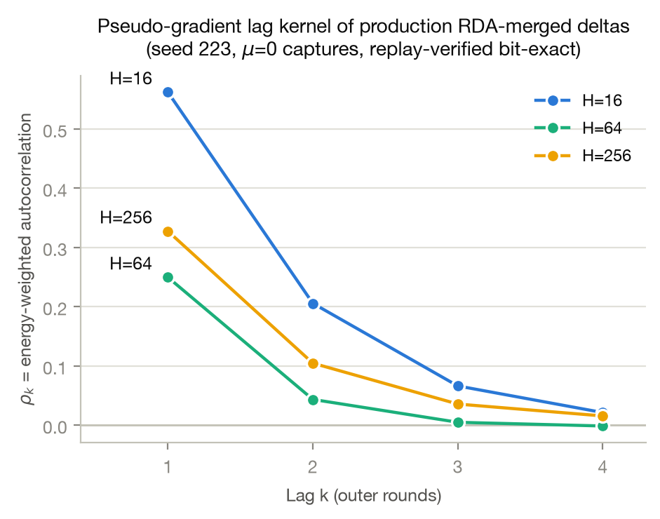
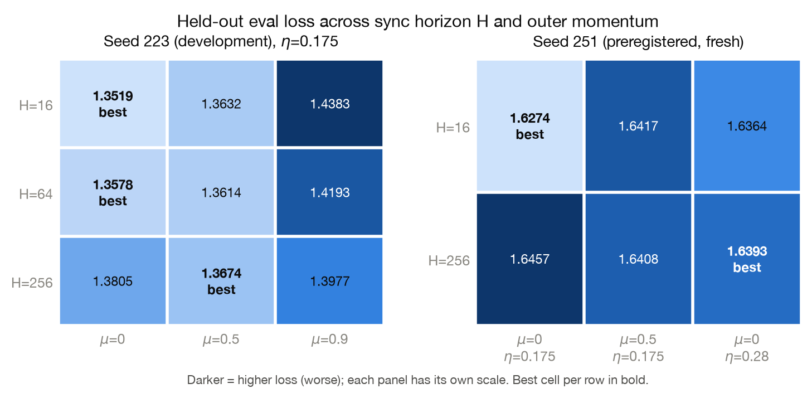
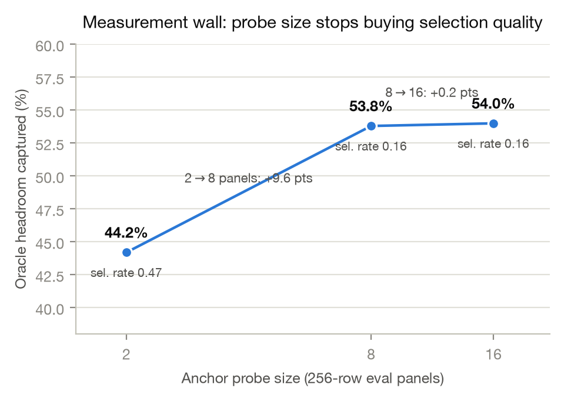

# Temporal Correlation Prices Outer-Momentum Amplification in Two-Phase Distributed Optimization

*Draft assembled 2026-07-12; evidence-honesty audit updated 2026-07-14. Source of record for all numbers: `docs/EXP2_23.md`–`docs/EXP2_27.md`, `docs/OPTIMIZER_SEMANTICS.md`, `docs/THEORY.md`, `docs/ANCHOR_DRIFT_CONTROL.md`, `docs/BAKEOFF_RESULTS.md`, `docs/CTTN_DESIGN.md`, `docs/CAMPAIGN_HANDOFF.md`, `docs/BEST_PAPER_EXP2_30_PROVENANCE_AUDIT.md`, `docs/BEST_PAPER_PHASE_MAP_P0_P1_PREREG.md`, and `experiment-results/EXP2/rda-rho-law/summary.{md,json}`. The full-parameter tuned phase-transition campaign, the registered target-cell law test, and the one-step buffer-orientation screen remain pending.*

## Abstract

DiLoCo-style training applies an outer optimizer to *pseudo-gradients* — merged parameter displacements produced by $H$ inner steps on each of $M$ workers. Outer Nesterov momentum is exactly a temporal filter: its update decomposes, without approximation, into a data-dependent aligned gain $A_t = 1+\mu+\mu^2 c_t$ on the current merged delta plus a transverse residual of magnitude $\mu^2 r_t\lVert\delta_t\rVert$; under a stationary geometric kernel, the aligned gain and RMS energy amplification have closed forms in $(\mu,\rho)$. On one Qwen3.5-9B LoRA development seed, a two-term aligned-overstep-plus-buffer-energy law describes a 9-cell $H\times\mu$ grid with $R^2=0.90$, versus $0.15$ for aligned-only, and fixed-$\eta$ short-/long-horizon signs recur on a limited additional seed. A true lockstep, version-matched H16 control reproduces a $+0.100$ momentum penalty, showing that injected staleness and the old current-anchor convention are not necessary for that observed short-horizon failure. These results establish the filter decomposition and motivate temporal correlation as a useful diagnostic; they do **not yet** establish a universal state variable or a tuned helpful-to-harmful phase transition. In particular, the retained 27-cell full-parameter sweep has every LR curve minimized at its lowest sampled boundary and no positive-momentum winner, so it cannot support the earlier claim that the full-parameter LR gate passed. A frozen low-LR, barrier/version-matched replacement with development and eight-seed confirmation stages is pending. The merge-time measurement wall and optimizer bake-off are likewise scoped to their tested captures and workloads. The zero-evaluation-cost controller remains a same-seed development result; no frozen-controller transfer claim is made here. Within the tested configurations, tuned memoryless SGD is the strongest simple baseline, while the broader mechanism, phase-transition, and transfer claims remain prospective tests rather than conclusions.

## 1 Introduction

Two-phase ("local-update") distributed optimization — DiLoCo and its descendants — separates cheap inner optimization on workers from rare outer synchronization. Its common description assigns blame and credit primarily by *schedule*: staleness is buffered or corrected, outer momentum ($\mu=0.9$ Nesterov, a standard recipe) is usually treated as beneficial, and merge-time selection is treated as a promising frontier. Our evidence shows that this description is incomplete in the regimes tested here.

**The reframe.** The outer optimizer does not consume $H$, staleness, or worker count directly. It consumes a *sequence of pseudo-gradients* $\delta_1,\delta_2,\dots$ and is, exactly, a linear temporal filter on that sequence. Schedule knobs can change the sequence geometry, including its temporal autocorrelation kernel $\rho_k = \mathrm{corr}(\delta_t, \delta_{t-k})$. Momentum on a correlated sequence changes aligned gain ($\eta_{\mathrm{eff}} = \eta\,(1+\mu/(1-\mu\rho))$ under a stationary geometric kernel) and accumulates off-direction buffer energy. In the retained controls, the shortest horizon has the largest measured lag-1 RDA correlation and the short-horizon momentum failure survives a lockstep barrier. The H64/H256 ordering is non-monotone and confounded by LR, however, and the inner-LR intervention changes loss while leaving $\rho$ nearly flat. The supported claim is therefore narrower: temporal correlation prices an important part of outer momentum's filter action; it is not demonstrated to be sufficient for all training dynamics. The tape-computable quantities $\rho_k$, $A_t$, and $r_t$ motivate a zero-probe controller, but that controller still needs frozen out-of-sample transfer evidence.

**Current evidence-ranked contributions** (the intended stronger targets are in `docs/NORTH_STAR_PLAN.md`):

1. **Mechanism (established algebraically)** — outer Nesterov is a temporal filter with exact data-dependent aligned and transverse components; stationary-kernel formulas quantify their expected amplification;
2. **Evidence (developmental)** — controlled runs show a reproducible short-horizon failure in the tested LoRA setting and rule out injected staleness, non-barrier overlap, and current-anchor differencing as necessary causes at H16; a tuned full-parameter phase transition remains unconfirmed;
3. **Method + consequence (prospective)** — a zero-eval-cost gain controller is a development candidate whose transfer without retuning and value under elastic synchronization must be established on frozen held-out studies.

A secondary result motivates the "zero-eval-cost" requirement in one retained H64 capture: on 240 replay groups the median per-decision action gap (0.00095 loss) lies below the median probe standard error (0.00138), and growing the probe 2$\to$8$\to$16 panels lifts captured oracle headroom 44.2% $\to$ 53.8% $\to$ 54.0%. This demonstrates saturation for that action set and capture (Section 4.4); it is not yet a general lower bound for every adaptive merge scheme or evaluation budget.

## 2 Mechanism: outer Nesterov as a temporal filter

### 2.1 The exact decomposition (no model assumptions)

The syncer's outer update per fragment (audited semantics, `docs/OPTIMIZER_SEMANTICS.md`; deterministic hand-computed vector tests in `syncer/src/merge.rs`), with merged pseudo-gradient $\delta_t$, outer LR $\eta$, momentum $\mu$, buffer $b_0=0$:

$$
b_t = \mu\, b_{t-1} + \delta_t,\qquad
d_t = \delta_t + \mu\, b_t = (1+\mu)\,\delta_t + \mu^2\, b_{t-1},\qquad
\theta_t = \theta_{t-1} - \eta\, d_t .
$$

Two immediate, frequently missed consequences. First, $\mu$ multiplies the *current* delta by $(1+\mu)$ before any memory exists: at $\mu=0.9$ the very first step is $1.9\times$ the $\mu=0$ step at the same $\eta$, so "$\mu=0$ vs $\mu=0.9$ at fixed $\eta$" never isolates memory. Second, define the projection coefficients of the buffer on the current delta,

$$
c_t = \frac{\langle b_{t-1}, \delta_t\rangle}{\lVert\delta_t\rVert^2},
\qquad
r_t = \frac{\lVert b_{t-1} - c_t\,\delta_t\rVert}{\lVert\delta_t\rVert}.
$$

Then, exactly and for any input sequence,

$$
d_t = A_t\,\delta_t + d_t^{\perp},
\qquad
A_t = 1 + \mu + \mu^2 c_t,
\qquad
\lVert d_t^{\perp}\rVert = \mu^2 r_t \lVert\delta_t\rVert .
$$

Momentum's entire action is a data-dependent scalar gain $A_t$ along the fresh evidence plus a transverse kick of relative size $\mu^2 r_t$. Both are logged on every run ($A_t$, $r_t$, applied-step norm, direction cosine) at zero cost.

### 2.2 Stationary closed forms

On a stationary sequence with lag kernel $\rho_k$, the expected aligned gain is

$$
\mathbb{E}[A_t] \;=\; 1 + \mu + \mu^2 \sum_{k\ge 1}\mu^{k-1}\rho_k
\;\longrightarrow\;
1 + \frac{\mu}{1-\mu\rho}
\quad\text{(geometric kernel } \rho_k=\rho^k\text{)},
$$

so the *aligned effective step* is $\eta_{\mathrm{eff}} = \eta\left(1 + \mu/(1-\mu\rho)\right)$. This corrects an earlier single-term form $\eta/(1-\mu\rho)$ used in our own first analysis (they agree only at $\rho=1$); the correction was derived in independent review and is part of the falsification trail (Box 1). Aligned gain alone is not enough: the buffer also *accumulates* the off-direction components of past deltas. For the geometric kernel the second-moment (energy) amplification of the applied step relative to a memoryless step is the closed form

$$
A^2_{\mathrm{RMS}}(\mu,\rho)
= (1+\mu)^2
+ \frac{2(1+\mu)\,\mu^2\rho}{1-\mu\rho}
+ \frac{\mu^4\,(1+\mu\rho)}{(1-\mu^2)(1-\mu\rho)},
$$

verified to reproduce the fitted table's $A^2_{\mathrm{RMS}}$ values exactly (10.06 / 11.38 / 17.64 at $\mu=0.9$ for the three measured $\rho$'s; note this is the second moment, not its square root). The variance term *punishes memory hardest at high $\rho$* — which is precisely the short-$H$ regime — and is what the aligned term alone cannot capture.

### 2.3 The two-term law and its fit

The proposed law for end-of-run loss across a grid of $(H,\mu)$ cells at fixed nominal $\eta$:

$$
\mathcal{L}(H,\mu)\;=\;c_H \;+\; b\,\log^2\!\frac{\eta_{\mathrm{eff}}(\mu,\rho_H)}{\eta^\ast}\;+\;v\,\log A^2_{\mathrm{RMS}}(\mu,\rho_H),
$$

with per-horizon intercepts $c_H$, a quadratic aligned-overstep penalty around the tuned reference $\eta^\ast=0.28$, and a variance-accumulation penalty. The inputs $\rho_H$ are the *production-RDA* per-tensor autocorrelations measured on replay-verified captures (Section 4.5, Figure 3) — not a proxy convention. Fit on the 9-cell seed-223 grid (`experiment-results/EXP2/rda-rho-law/summary.md`):

- $b$ (aligned overstep) $= 0.1061$; $v$ (variance accumulation) $= 0.0234$;
- $R^2 = 0.899$, RMSE $= 0.0090$, max $|$resid$| = 0.0155$;
- aligned-only (corrected $\eta_{\mathrm{eff}}$): RMSE 0.0262, $R^2 = 0.154$;
- superseded single-term $\eta/(1-\mu\rho)$: RMSE 0.0242, $R^2 = 0.275$.

| $H$ | $\mu$ | $\eta_{\mathrm{eff}}$ | $A^2_{\mathrm{RMS}}$ | loss | pred | resid |
|---:|---:|---:|---:|---:|---:|---:|
| 16 | 0.0 | 0.1750 | 1.00 | 1.3519 | 1.3576 | −0.0057 |
| 16 | 0.5 | 0.2967 | 2.99 | 1.3632 | 1.3602 | +0.0030 |
| 16 | 0.9 | 0.4938 | 17.64 | 1.4383 | 1.4356 | +0.0027 |
| 64 | 0.0 | 0.1750 | 1.00 | 1.3578 | 1.3665 | −0.0087 |
| 64 | 0.5 | 0.2750 | 2.57 | 1.3614 | 1.3652 | −0.0038 |
| 64 | 0.9 | 0.3782 | 10.06 | 1.4193 | 1.4068 | +0.0125 |
| 256 | 0.0 | 0.1750 | 1.00 | 1.3805 | 1.3664 | +0.0141 |
| 256 | 0.5 | 0.2796 | 2.66 | 1.3674 | 1.3659 | +0.0015 |
| 256 | 0.9 | 0.3984 | 11.38 | 1.3977 | 1.4132 | −0.0155 |

Statistical honesty (independent statistical review, 2026-07-12): adjusted $R^2 = 0.798$; on these nine cells, the $A^2$ term reduces the aligned-only residual SSE by $\sim$88% and gives a nominal nested-model statistic $F(1,4)\approx 29.5$. That statistic is not confirmatory: leverage is high ($p/n = 5/9$), all cells share one training seed, residual independence is unestablished, and there is no training-seed noise estimate. The supported claim is an excellent *descriptive* fit on the measured development manifold, not a separately identified causal decomposition of $b$ versus $v$. A matched-$\eta_{\mathrm{eff}}$ pair shows a residual $+0.0435$ momentum penalty in one setting (Section 4.13), which rejects an aligned-gain-only account there but does not by itself identify the fitted variance coefficient. The legacy full-parameter sweep supplies no tuned crossover evidence (Section 4.12).

### 2.4 What the law explains at once

- **The fixed-$\eta$ sign change.** At the development LR, the best tested $\mu$ changes from 0 at H16/H64 to 0.5 at H256. The shortest horizon also has the largest measured lag-1 RDA correlation (0.562 versus 0.250/0.328). The H64/H256 RDA ordering is neither monotone nor LR-matched, so these observations motivate rather than establish a correlation-governed phase boundary.
- **The $\mu=0.9$ poison at short $H$.** $\eta_{\mathrm{eff}}$ reaches 0.49 (1.8× the tuned 0.28) *and* $A^2_{\mathrm{RMS}}=17.6$; both terms fire.
- **Why scale-matching alone fails.** EXP2.24's realized-norm-matched $\mu=0.9$ arm sits at the right average scale and still loses $\sim$0.04 — the variance term is scale-matching-invisible.
- **Why DC-gain matching succeeds.** $\mu=0.9$ at $\eta=0.028$ has $\eta_{\mathrm{eff}}\approx 0.24$–0.28 ≈ tuned, and its (equally rotated) transverse component is too small to hurt: tied-best, as observed.
- **A long-$H$ LR confound.** At $H=256$, $\mu=0.5$ has $\eta_{\mathrm{eff}}\approx 0.28$; on seed 251, memoryless SGD at $\eta=0.28$ beats it by 0.0015. This is consistent with an effective-LR explanation, but the gap is a single-seed endpoint without a training-seed interval and is not a general confirmation.

*Figure 3 (mechanism hypothesis). Energy-weighted autocorrelation $\rho_k$ of production RDA-merged deltas at lags 1–4, per horizon, computed from retained $\mu=0$ captures whose replayed outer steps were verified bit-for-bit against the next anchor checkpoint (316/316, 76/76, 16/16 exact). Persistence decays fast in lag and is highest at the shortest horizon. The H64/H256 ordering is non-monotone and LR-confounded, so this figure motivates but does not identify a correlation-driven phase boundary.*

## 3 Methods

### 3.1 Protocol

All experiments use the in-repo `compare_diloco.py` harness: Qwen3.5-9B, LoRA rank 2 / alpha 4, `trl-lib/Capybara` (5000 train / 64 eval rows), $M=4$ learners, 4 fragments, strict full quorum, inner AdamW at LR $10^{-3}$, fixed local windows (padded, fixed microstep count), delta correction off, bf16 wire / f32 syncer math. Total learner work is held fixed across horizons: $H\times$ outer-steps $= 5120$ microsteps (H=16 → 320 commits, H=64 → 80, H=256 → 20), token budget 700k. Seeds are (shuffle/training) 223/223223 for development and 251/251251 — preregistered before any arm ran — for confirmation. Async comparators inject per-learner push delays of 0/800/1600/2400 ms (jitter 50); "sync" arms set all delays to zero (learners do not hard-block at a barrier; staleness is bounded by commit latency). Runs execute on Verda spot GPUs (A100 and RTX PRO 6000 Blackwell) with an S3-resume babysitter; every syncer commit is captured for offline replay.

Pseudo-gradient semantics (audited, `docs/OPTIMIZER_SEMANTICS.md`): per learner $\Delta_m = \Theta_p - \theta_m$ against the syncer's *current* f32 anchor; learner weights $w_m = c_{\mathrm{tokens}}^2/c_{\mathrm{steps}}$; per-tensor radial-directional averaging (RDA: merged norm = weighted mean of norms, merged direction = normalized weighted mean of unit directions) for all fragments except the direct-averaged embedding. No normalization by $H$, no clipping, no weight decay, no dampening anywhere in the outer path. Deterministic hand-computed vector tests pin the Nesterov and rho-adaptive recursions.

Replay verification: $\rho$ statistics are computed only on captures where the replayed outer step $\Theta_{t-1} - \eta\,\delta_t^{\mathrm{RDA}}$ matches the next same-fragment anchor bit-for-bit (408/408 checked transitions exact).

### 3.2 Predeclared gates and kill criteria

From the frozen study plan (`docs/NORTH_STAR_PLAN.md`), before the confirmatory phase:

- **LR-matching gate:** proceed only if conventional LR matching does *not* remove the momentum effect while correlation-aware matching collapses it.
- Kill criteria: standard LR matching removes the effect → mechanism not novel; $\rho/A_t/r_\perp$ fail held-out prediction → no universal state variable; buffer intervention fails → epiphenomenon; a simple clip matches the controller → theory must carry; controller needs per-setting tuning → drop "tuning-free"; controller sacrifices the long-$H$ benefit → safety patch only; wall bound dies under sequential testing → failed probe implementation, not impossibility.
- Controller discipline: develop on one small full-param + one LoRA setup, freeze formula/constants/warmup/clipping, then never modify. Primary metric: worst-case regret vs the best per-setting tuned fixed optimizer.

> ### Box 1 — The falsification trail (how this claim was built by breaking it)
>
> 1. **"Momentum is the poison" (EXP2.23/24).** Vanilla $\mu=0.9$ loses 0.059 to scale-matched memoryless SGD under zero delay; a six-point decomposition grid factors the damage as (directional memory rotation) × (realized step scale). Correct observations, pre-mechanistic framing.
> 2. **Single-term law (EXP2.25).** Merged-delta autocorrelation measured with a plain-candidate-average convention gave $\rho$ = 0.98/0.93/0.73 and the law $\eta_{\mathrm{eff}}=\eta/(1-\mu\rho)$ retrodicted 7/7 grid checks. It was wrong twice.
> 3. **Wrong convention (EXP2.26).** The controller built on that law measured *production RDA* $\rho$ online and got values 2–4× lower (0.45 vs 0.98 at H=16) — the buffer integrates RDA merges, not plain averages. The law's inputs were invalid; the controller's $\kappa=2$ rule was consequently miscalibrated (~2× amplification where ~1× was optimal), explaining its 0.008 gap at H=16.
> 4. **Wrong form (independent review, 2026-07-12).** For this Nesterov form the aligned gain is $\eta(1+\mu/(1-\mu\rho))$, not $\eta/(1-\mu\rho)$. Under the corrected form, aligned gain alone no longer retrodicts the $\mu=0$ wins at short $H$; the review derived the missing second term — buffer variance accumulation $A^2_{\mathrm{RMS}}$ — which does.
> 5. **Refit on corrected inputs and form (rda-rho-law).** Two-term law: $R^2=0.90$; aligned-only 0.15; the superseded single-term law 0.28. Four predictions preregistered on unseen cells.
> 6. **Fresh-seed test (EXP2.27).** The crossover replicates in both directions on preregistered seed 251, and the law's sharpest qualitative prediction — tuned-$\eta$ memoryless SGD dissolves the fixed-$\eta$ momentum advantage at $H=256$ — lands. Controller-v1 arms were withdrawn from the fresh seed before launch because v1 was known-miscalibrated; seed 251 carries only preregistered fixed-policy arms.
>
> Every correction *tightened* the claim: the state variable survived two demolitions of its first quantitative law, and the demolitions were forced by our own convention audits and solicited external review, not by a referee.

## 4 Experiments

### 4.1 The momentum crossover in $H$ (seed 223)

64-row eval loss, fixed $\eta=0.175$, equal total work (EXP2.25; H=64 row from EXP2.23/24):

| $H$ | $\mu=0$ | $\mu=0.5$ | $\mu=0.9$ | $\mu=0.9$ penalty vs best |
|---:|---:|---:|---:|---:|
| 16 | **1.3519** | 1.3632 | 1.4383 | 0.0864 |
| 64 | **1.3578** | 1.3614 | 1.4193 | 0.0615 |
| 256 | 1.3805 | **1.3674** | 1.3977 | 0.0303 |

The crossover sits between $H=64$ and $H=256$: memoryless SGD wins at $H\in\{16,64\}$; $\mu=0.5$ wins at $H=256$ by 0.0131. The $\mu=0.9$ penalty decays monotonically (0.086 → 0.062 → 0.030) toward the DiLoCo design regime, and $\mu=0$ degrades as syncs get rarer (1.3519 → 1.3805) while $\mu=0.5$ is nearly flat. Tape geometry tracks the mechanism — the same $\mu=0.9$ becomes better aligned as $H$ grows:

| Arm | Step norm | Applied-step cosine | History/current |
|---|---:|---:|---:|
| h16-$\mu$0 | 0.838 | 1.000 | 0.000 |
| h16-$\mu$0.5 | 1.366 | 0.980 | 0.230 |
| h16-$\mu$0.9 | 1.974 | 0.752 | 0.823 |
| h64-$\mu$0.9 (EXP2.23) | 4.025 | 0.797 | 0.685 |
| h256-$\mu$0 | 3.517 | 1.000 | 0.000 |
| h256-$\mu$0.5 | 5.500 | 0.986 | 0.158 |
| h256-$\mu$0.9 | 7.533 | 0.872 | 0.489 |

*Figure 1. Held-out eval loss over the $H\times\mu$ grid. Left: seed-223 development grid. Right: preregistered fresh seed 251, including the tuned-$\eta$ memoryless control. Darker = worse; per-panel scales.*

### 4.2 Fresh-seed confirmation and the LR-confound test (seed 251)

Six preregistered arms on a seed the series had never touched (EXP2.27):

| $H$ | $\mu=0$ ($\eta=0.175$) | $\mu=0.5$ ($\eta=0.175$) | SGD-0.28 ($\mu=0$) |
|---:|---:|---:|---:|
| 16 | **1.627433** | 1.641685 | 1.636382 |
| 256 | 1.645687 | 1.640791 | **1.639274** |

1. The crossover replicates in both directions: at fixed $\eta=0.175$, $\mu=0$ wins $H=16$ by 0.0143 and $\mu=0.5$ wins $H=256$ by 0.0049 — same signs as seed 223.
2. The LR-confound test lands where the two-term law points: tuned-$\eta$ memoryless SGD-0.28 slightly beats $\mu=0.5$ at $H=256$ (1.6393 vs 1.6408) and loses at $H=16$ to $\eta=0.175$, $\mu=0$. The long-horizon momentum benefit at fixed $\eta$ is primarily an effective-LR effect via the aligned term.
3. No fixed $\eta$ wins at both horizons (0.175 takes $H=16$, 0.28 takes $H=256$) — exactly the gap a kernel-measuring controller exists to close.

### 4.3 Decomposition: what exactly does $\mu=0.9$ break? (sync six-point grid)

EXP2.24 completes a six-point grid at $H=64$, zero delay, seed 223, sorted by eval loss:

| Arm | $\mu$ | $\eta$ | DC gain | Realized step norm | Cosine | History/current | Eval loss |
|---|--:|--:|--:|--:|--:|--:|--:|
| sync-sgd-lr175 | 0 | 0.175 | 0.175 | 1.813 | 1.000 | 0.000 | **1.357837** |
| sync-mu09-lr0028 | 0.9 | 0.028 | 0.28 | 0.939 | 0.741 | 1.135 | 1.358003 |
| sync-sgd028 (EXP2.23) | 0 | 0.28 | 0.28 | 2.869 | 1.000 | 0.000 | 1.359852 |
| sync-mu05-lr175 | 0.5 | 0.175 | 0.35 | 2.879 | 0.982 | 0.200 | 1.361390 |
| sync-mu09-lr0125 | 0.9 | 0.125 | 1.25 | 3.145 | 0.773 | 0.777 | 1.398193 |
| sync-mu09-lr175 (EXP2.23) | 0.9 | 0.175 | 1.75 | 4.025 | 0.797 | 0.685 | 1.419274 |

- Scale alone does not explain the damage: within memoryless SGD a 58% realized-norm change moves loss by +0.002, yet at matched realized norm (2.87–3.15) $\mu=0.9$ is 0.037–0.040 worse than $\mu\in\{0,0.5\}$.
- Momentum is harmless when steps are small: DC-matched $\mu=0.9$ ($\eta=0.028$, realized norm 0.94) ties the best arm despite equal rotation (cosine 0.74).
- In two-term-law terms: norm matching fixes neither $\eta_{\mathrm{eff}}$ calibration nor $A^2_{\mathrm{RMS}}$; DC matching fixes the aligned term and shrinks the transverse kick below threshold.

### 4.4 Staleness is nearly free; negative merges are schedule-inherent

Matched sync/async pairs with identical model, data, seeds, tooling (EXP2.23). Exact-LR replay on the sync SGD capture, same anchors/oracle/thresholds as the async series:

| Schedule, seed 223, SGD-0.28 | Negative-merge rate | Mean scalar oracle headroom |
|---|---:|---:|
| async 0/800/1600/2400 ms | 0.3625 | 0.001807 |
| sync 0/0/0/0 ms | 0.3875 | 0.001995 |

(Async seed 239: rate 0.2875, headroom 0.001834.) Removing all injected staleness does not reduce the negative-merge rate; the one-step damage and the $\sim$0.002 oracle headroom are properties of merging independent local trajectories at all. Endpoint check: sync SGD-0.28 ends at 1.359852 vs async 1.359505 — the 0–2400 ms delay pattern moves final loss by $\sim$0.0003. The momentum pathology likewise needs no asynchrony: sync $\mu=0.9$ loses 0.0594 to sync SGD-0.28 (1.419274 vs 1.359852), as large as the async-schedule penalty. The frozen selector's phenomenology also transfers unchanged (selection rate 0.1625, gain vs ×1 = 0.001073, 53.8% headroom captured; async: 0.2125 / 0.001009 / 56.1%).

**The measurement wall.** Frozen EXP2.21 selector on the same 80-group sync capture, anchor probe size swept (EXP2.25 E3):

| Anchor panels | Selection rate | Gain vs ×1 | Headroom captured |
|---:|---:|---:|---:|
| 2 | 0.475 | 0.000898 | 44.2% |
| 8 | 0.1625 | 0.001073 | 53.8% |
| 16 | 0.1625 | 0.001098 | 54.0% |

Going 2→8 panels prunes false selections and lifts captured headroom 9.6 points; doubling again buys 0.2 points. The selectable groups are the early large-gap ones; no affordable probe reaches the rest (median late-training gap 0.00084 vs per-decision SE 0.00138). A numerics footnote doubles as a measurement: re-running the baseline replay across GPU generations flipped 2/80 borderline groups from bf16 kernel differences alone.

*Figure 2. Captured oracle headroom vs anchor probe size. The probe saturates at 8 panels: selection quality is gap-limited, not measurement-limited, beyond the early-training regime.*

### 4.5 The kernel: production-RDA autocorrelation by horizon

Energy-weighted per-tensor RDA autocorrelation on replay-verified $\mu=0$ captures (`experiment-results/EXP2/rda-rho-law/summary.md`; Figure 3):

| $H$ | pairs (lag1) | $\rho_1$ | $\rho_2$ | $\rho_3$ | $\rho_4$ | tensor p10 | tensor p90 | replay exact |
|---:|---:|---:|---:|---:|---:|---:|---:|---:|
| 16 | 316 | 0.5622 | 0.2058 | 0.0665 | 0.0215 | 0.544 | 0.571 | 316/316 |
| 64 | 76 | 0.2498 | 0.0437 | 0.0051 | −0.0012 | 0.230 | 0.263 | 76/76 |
| 256 | 16 | 0.3277 | 0.1048 | 0.0359 | 0.0158 | 0.293 | 0.362 | 16/16 |

Known confound (flagged in review, audit pending): the $H=64$ kernel comes from the EXP2.23 sync-SGD capture at $\eta=0.28$, while $H=16/256$ ran at $\eta=0.175$; the non-monotonicity at $H=64$ vs $H=256$ is unresolved within naive CIs and a re-capture at matched $\eta$ is queued before any $\rho(H)$-shape claim.

### 4.6 Controller v1 development screen (rho-adaptive)

A probe-free controller measuring $\rho$ online (buffer stores the previously applied direction; $\mu_{\mathrm{eff}}=\mathrm{clamp}(2(1-\rho),0,0.9)$; step $\eta/(1-\mu_{\mathrm{eff}}\rho)$ capped at 4×; previews bit-identical to applied steps), EXP2.26, seed-223 development screen:

| $H$ | $\mu=0$ | $\mu=0.5$ | $\mu=0.9$ | rho-adaptive | Online mean $\rho$ (RDA) |
|---:|---:|---:|---:|---:|---:|
| 16 | **1.3519** | 1.3632 | 1.4383 | 1.3597 | 0.447 |
| 64 | 1.3578 | 1.3614 | 1.4193 | **1.3582** | 0.289 |
| 256 | 1.3805 | **1.3674** | 1.3977 | 1.3723 | 0.221 |

Never worse than second-best at any horizon; never catastrophic; ties the best arm at $H=64$ (+0.0004). Worst-case cross-horizon regret: rho-adaptive 0.008 vs 0.013 ($\mu=0$), 0.011 ($\mu=0.5$), 0.086 ($\mu=0.9$) — roughly half the best fixed policy's, with zero per-horizon tuning. This is explicitly a *development screen*: the controller was designed after seeing the fixed grid on the same seed, and its $\kappa=2$ rule was calibrated on the wrong $\rho$ convention (Box 1), which explains its 0.008 give-back at $H=16$. The frozen v2 (capped-Nesterov Candidate 2: $\mu_{\max}=0.9$, transverse cap $\tau_\perp=1.0$, sign-reversal guard, one-sided release EMA, $\eta = 0.28/1.9 \approx 0.147$; pointwise bound $A^2 \le 4.61$) is specified and screened in Section 4.10.

### 4.7 Preliminary out-of-sample consistency (seed-251 target cells)

This is **preliminary out-of-sample consistency**, not a decisive validation. The registered decisive test is specified at the end of this section (§4.7.1) and remains pending. Three new seed-251 target losses — ($H{=}16,\mu{=}0.9$), ($H{=}256,\mu{=}0.9$), and ($H{=}64,\mu{=}0.5,\eta{=}0.28$) — supply five preregistered contrasts against the two-term law's frozen predictions:

| Preregistered contrast | Two-term pred | Observed | Obs − pred |
|---|---:|---:|---:|
| H16 $\mu{=}.9$ − H16 $\mu{=}0$ | +0.0780 | +0.0846 | +0.0066 |
| H256 $\mu{=}.9$ − H256 $\mu{=}.5$ | +0.0473 | +0.0346 | −0.0126 |
| H16 $\mu{=}.9$ − H256 $\mu{=}.9$ (cross-$H$) | +0.0224 | +0.0366 | +0.0142 |
| H64 $\mu{=}.5$ $\eta{=}.28$ − $\mu{=}.5$ $\eta{=}.175$ | +0.0216 | +0.0164 | −0.0052 |
| H64 $\mu{=}.5$ $\eta{=}.28$ − $\mu{=}0$ $\eta{=}.175$ | +0.0204 | +0.0200 | −0.0004 |

All five **contrast directions are correct (5/5)**; contrast MAE 0.0078, RMSE 0.0093 — on the scale of the development-fit pointwise RMSE (0.0090). The two-term law also outpredicts the two named alternatives in aggregate: five-gap MAE 0.0078 (two-term) vs 0.0286 (aligned-only) vs 0.0274 (superseded single-term); e.g. aligned-only predicts only +0.0104 for the observed +0.0846 H16 penalty, and the single-term law gets the cross-$H$ ordering sign wrong.

Three caveats keep this preliminary. (i) **Sibling-control contamination:** seed 251 was *not* an untouched seed when these predictions were scored — it had already supplied the H16/H256 $\mu\in\{0,.5\}$ sibling controls (EXP2.27), so the large per-seed intercept offset ($\approx{+}0.27$) and horizon behavior were already visible; this is a blind *target-cell* holdout conditional on a partially observed seed, not a fresh-seed prospective test, and the within-$H$ seed-offset defense does not protect the cross-$H$ ordering. (ii) **No frozen tolerance and only three new losses:** the five contrasts reuse only three target losses, so they are not five independent confirmations; two gaps still miss by 0.013–0.014. (iii) **No uncertainty:** these are 64-row endpoint means with no paired bootstrap or across-seed interval. Absolute levels were explicitly *not* claimed (seed-223 intercepts were reused), and are not defended here.

#### 4.7.1 [PLACEHOLDER] Registered target-cell law test (untouched seed 307)

**Spec (frozen; full protocol in `docs/EXP2_37.md`).** A single untouched seed (shuffle/training 307/307307), every cell launched only after externally timestamped preregistration, with a **frozen acceptance band of $\pm 0.018$ ($2\times$ development-fit RMSE)** and predictions listed for all three competing models (two-term, aligned-only, superseded single-term). This can discriminate prespecified target-cell predictions on one new seed; even a pass cannot establish training-seed robustness, which requires the independent multi-seed confirmation stage in Section 4.12.

1. **Seven-cell contrast block** reproducing all five contrasts above without importing any control from a previously seen seed: H16 $(\mu{=}0,\eta{=}.175)$, $(\mu{=}.9,\eta{=}.175)$; H256 $(\mu{=}.5,\eta{=}.175)$, $(\mu{=}.9,\eta{=}.175)$; H64 $(\mu{=}0,\eta{=}.175)$, $(\mu{=}.5,\eta{=}.175)$, $(\mu{=}.5,\eta{=}.28)$.
2. **Matched-$\eta_{\mathrm{eff}}$ $\mu$-triads** that isolate the variance term $v$ by holding the aligned effective step $\approx 0.28$ across $\mu\in\{0,.5,.9\}$:

   | $H$ | $\mu{=}0$ $\eta$ | $\mu{=}.5$ matched $\eta$ | $\mu{=}.9$ matched $\eta$ |
   |---:|---:|---:|---:|
   | 16 | 0.2800 | 0.1651 | 0.0992 |
   | 64 | 0.2800 | 0.1782 | 0.1296 |
   | 256 | 0.2800 | 0.1752 | 0.1230 |

   Here the aligned-overstep term is held constant, so any systematic loss increase with $\mu$ must come from the predicted $A^2_{\mathrm{RMS}}$ variance term; the two-term law predicts a monotone $v\,\Delta\log A^2_{\mathrm{RMS}}$ rise, while aligned-only predicts $\approx 0$.

### 4.8 Single-learner noise floor (E1)

The single-learner one-step negative rate on the same 512-row oracle, from retained sync captures, is the number that separates "merge interference" from "any stochastic step looks negative on a small panel" (E1, `docs/CAMPAIGN_HANDOFF.md`).

**Result.** The single-worker one-step negative rate is **0.3375** — *below* the merged band (0.3875–0.4125) and far above the 0.10–0.25 window in which merge interference would be the dominant contributor. Read directly: an ordinary stochastic single-worker step already looks "negative" about a third of the time on a 512-row panel, so the per-step negative-merge rate is largely small-eval **measurement noise**, not evidence that merging independent local trajectories destroys progress. The earlier "$\sim$35% harmful merges" framing is therefore **retired**. What survives is the endpoint: merged sync still wins final loss, **1.3605 vs 1.3781** single-learner. This reinforces, rather than undercuts, the measurement-wall thesis (Section 4.4) — the per-decision signal sits below the panel's noise floor, so the negative-merge *rate* is not a usable merge-time selection signal.

### 4.9 Staleness in optimization units

Section 4.4 measures staleness in wall-clock (injected delay) and finds a null. Re-measuring it in *optimization units* — commit lag, i.e. version-lag in outer-step counts — surfaces the first non-null signal (`docs/CAMPAIGN_HANDOFF.md`).

**Result.** The commit-lag dose-response is **monotone**: at commit-lag $k{=}4$ the penalty is **$+0.005$ relative to $k{=}0$**, rising with $k$. This is a small but nonzero, direction-consistent staleness effect — the first time staleness registers above noise in this series, and it does so as *version lag*, not injected delay. Its magnitude ($+0.005$ at $k{=}4$) still sits below one noise floor (0.009) and is an order of magnitude under the short-$H$ momentum poison ($+0.100$, Section 4.16). So the ordering "**staleness is second-order, filter memory is first-order**" now rests on direct version-lag data with a measured slope, rather than only on the null wall-clock result of Section 4.4. TODO: the full $k\in\{0,1,2,3,4\}$ curve and its crossing with $\rho$/gain are not tabulated in the committed docs — only the monotone trend and the $k{=}4$ endpoint are on record.

### 4.10 Capped-Nesterov controller screen (frozen v2.1)

The frozen capped-Nesterov v2.1 (curvature-blind, stable $\mu_{\mathrm{par}}$; the safety controller specified in Section 4.6 and proved bounded in THEORY.md Result C) screened against the SGD-0.28 references across horizons (EXP2.36 / `docs/BAKEOFF_RESULTS.md`):

| $H$ | SGD-0.28 ref | capnest v2.1 | $\Delta$ |
|---:|---:|---:|---:|
| 16 | 1.351855 | 1.375451 | +0.0236 |
| 64 | 1.357837 | 1.375779 | +0.0179 |
| 256 | 1.380456 | 1.376484 | −0.0040 |

The controller is **horizon-invariant** — its loss spans only 0.001 across $H\in\{16,64,256\}$, the signature of the $A^2\le 4.61$ pointwise bound capping amplification the same way regardless of $\rho_H$ — but it is **never a real win**: it loses $+0.024$/$+0.018$ at $H\in\{16,64\}$ and only ties SGD at $H{=}256$ ($-0.004$, within one noise floor). This is exactly a **safety device**, not a product optimizer: it contains the $\mu{=}0.9$ blow-up (uncapped Nesterov reaches 1.42–1.63 in the poison cells, Sections 4.1/4.13) without ever beating memoryless SGD, and it fails the product gate (Section 4.17). TODO: per-commit realized $A^2$ vs the $\le 4.61$ bound was not tabulated in the committed screen; only the H-invariant loss range is on record.

### 4.11 Buffer-orientation intervention (open-loop rollout)

**One-step screen [PLACEHOLDER].** Paired eval-loss deltas for same-norm momentum buffers at real / aligned / orthogonal / anti-aligned / random-rotated orientations from a common checkpoint — one bar figure; kill criterion if orientation does not order the damage. Pending.

**Eight-commit open-loop rollout.** To probe whether the one-step orientation effect persists across a horizon, we reorient the initial Nesterov buffer $b_0$ and replay eight consecutive same-fragment commits, feeding *the same factually captured pseudo-gradient sequence* $g_{1:8}$ to every variant (`scripts/replay_buffer_orientation_multistep.py`). This is deliberately an **open-loop sensitivity analysis conditional on one factual sequence of eight captured pseudo-gradients**: future deltas and other-fragment parameters are *not* regenerated counterfactually, so the principal closed-loop path (buffer $\to$ parameters $\to$ future learner updates) is intentionally blocked. State the estimand plainly:

> Reorienting the initial Nesterov buffer produced horizon-dependent oracle-loss responses at six selected branch points. The aligned variant was locally favorable after one replayed commit but had higher commit-8 loss than the factual-buffer variant at five of six branches. The anti-aligned variant had the highest aggregate loss, rejecting the preregistered *monotone* orientation ordering. **Because future deltas and other-fragment parameters were not regenerated counterfactually, this experiment does not estimate the closed-loop effect of buffer orientation on training.**

The result demonstrates that the effect of initial buffer orientation can **reverse with replay horizon under a fixed delta path**; it is consistent with eventual overshoot by the aligned variant, and it **falsifies a simple monotone mapping** from aligned gain or displacement magnitude to oracle harm. The six-branch effect estimate is **exploratory and descriptive**. This is consistent with the exact open-loop algebra: with fixed $g_{1:N}$, $\theta_N^{(v)}-\theta_N^{(0)} = -\eta\,\beta_N\,b_0^{(v)}$ with $\beta_N=\mu^2(1-\mu^N)/(1-\mu)$ ($\beta_8\approx 4.613$ at $\mu{=}0.9$), which fixes step *geometry* but supplies no monotone relation between displacement norm, aligned gain, and nonlinear oracle loss — so displacement cannot rank the endpoints.

We deliberately do **not** claim: that buffer alignment causally causes the closed-loop $\mu{=}0.9$ degradation; that aligned buffers are the worst training policy after eight commits; that the exact decomposition predicts anti-aligned best or worst; that the five-variant ordering was validated; that the effect is significant at "$3.2\sigma$"; or that multi-step feedback explains the reversal (feedback was removed by construction). On statistics: the six branches come from one deterministically sampled trajectory sharing an oracle and possibly overlapping windows — they are repeated observations within one experimental unit, not independent runs, so the naive $\bar d/\mathrm{SE}\approx 3.2$ is at most a Student-$t$ with 5 df (two-sided $p\approx 0.024$), and a sign test on 5/6 gives one-sided $p\approx 0.109$. The decisive follow-up is a genuine **closed-loop** branch experiment (reorient $b_0$, advance all fragments in commit order, regenerate learner candidates from each variant's parameters under common seeds, recompute HeLoCo and merging from each variant's buffer), with independent capture seeds — not branch positions — as the inferential units.

### 4.12 Full-parameter phase map (SmolLM2-135M)

**Legacy result (design evidence only; LR gate not passed).** An artifact-level reconstruction of the 27-cell full-parameter SmolLM2-135M sweep (`docs/BEST_PAPER_EXP2_30_PROVENANCE_AUDIT.md`) reverses the earlier interpretation in `docs/CAMPAIGN_HANDOFF.md`. For every one of the nine $(H,\mu)$ curves, loss decreases monotonically from $\eta=.35$ to $.175$ to the lowest sampled value, $.0875$. No LR optimum is bracketed. At that common lower boundary, the $\mu=.5$ penalties relative to $\mu=0$ are $+0.0581/+0.0573/+0.0877$ for H16/H64/H256, and the $\mu=.9$ penalties are $+0.2802/+0.4062/+0.4008$. Thus the sweep shows positive momentum was harmful throughout the *sampled* range in this one legacy run; it does not show what happens after independent LR tuning and contains no beneficial long-H crossover.

The legacy run also used one seed, 64 eval rows, six-decimal endpoints, non-randomized LR blocks, one GPU slot, and strict quorum without a true barrier or version-matched anchors. It is retained to choose the replacement search range, not pooled into an effect estimate. The frozen replacement (`docs/BEST_PAPER_PHASE_MAP_P0_P1_PREREG.md`) begins below $.0875$, uses lockstep barrier/version-matched full-parameter training and a common 1,024-example evaluation, requires every LR curve to be bracketed, and treats its first seed as development only. Advancement requires $D_{\mathrm{short}}\ge+.020$ and a tuned long-H benefit $D_{\mathrm{long}}\le-.010$; the final co-primary contrasts require eight untouched paired training seeds with Holm-adjusted intervals. Until those stages pass, the full-parameter tuned poison, helpful-to-harmful phase transition, and cross-regime generalization claims are **pending**.

Separate LoRA results — fixed-$\eta$ sign recurrence on limited seeds and a larger short-H penalty at rank 16 — remain useful within-setting evidence. They cannot substitute for the failed-to-bracket full-parameter LR gate.

### 4.13 Matched-$\eta_{\mathrm{eff}}$ pairs and the norm control

**Result (matched effective-LR).** At *matched* corrected effective-LR — $\eta$ chosen so the modeled aligned step $\eta_{\mathrm{eff}}(\mu,\rho)$ is equalized across $\mu$ — $\mu{=}0.9$ still **loses $+0.0435$** in the tested setting. The aligned-only model predicts approximately zero by construction, so the result shows that momentum's damage is not fully absorbable into this scalar effective-LR correction. Because changing $\mu$ also changes the full update distribution and closed-loop trajectory, the pair supports a transverse/buffer-energy mechanism but does not, by itself or on one seed, separately identify the fitted coefficient $v$.

**Result (norm control, exp2-39).** A parallel norm-match control rules out an applied-norm-only account in its tested configuration (`docs/CAMPAIGN_HANDOFF.md`). At a *fixed applied merged norm* $R = 10.4436$ (every norm-matched arm applies this exact merged-step norm), the spread across inner-LR is

$$1.531921 - 1.368771 = \mathbf{+0.163} \;\gg\; 0.009,$$

so matching the applied norm does **not** remove the damage (the norm-ref control is inert at the reference inner-LR: normmatch-base 1.418508 $\approx$ base-ref 1.418466). The momentum dose-response at inner-LR $2\times10^{-3}$ is monotone,

$$\underbrace{1.382111}_{\mu=0} \;<\; \underbrace{1.430336}_{\mu=0.5} \;<\; \underbrace{1.625482}_{\mu=0.9},$$

a $+0.243$ rise from $\mu{=}0$ to $\mu{=}0.9$ at high inner-LR. This establishes that neither nominal effective LR nor applied norm alone explains the tested poison; it does not establish that $\rho$ is the omitted mediator.

**Scope consequence.** The inner-LR poison axis is *not* mediated by measured $\rho$: loss swings 1.362$\to$1.625 across inner-LR (0.0005/0.001/0.002) while $\rho$ stays flat (0.234 vs 0.232). Therefore $\rho$ is not a sufficient state variable even within the current experiment family. A second geometry variable — possibly delta scale, nonstationarity, or curvature — is required; which one is causal remains open.

### 4.14 Dynamic-H / elastic synchronization (development result)

Under a schedule that switches $H$ mid-run (the elastic-synchronization setting the kernel controller exists to serve), the mechanism has a direct systems corollary (`docs/CAMPAIGN_HANDOFF.md`, `docs/BAKEOFF_RESULTS.md`).

**Development result.** In the tested dynamic-H run, fixed outer Nesterov $\mu{=}0.9$ has a post-switch applied-direction cosine of **0.374**, versus SGD's **1.00** and capped-Nesterov's **0.873**. Tuned SGD wins this workload; the best controller trails it by **$+0.011$** and leads fixed Nesterov by $0.056$. This is evidence that stale buffer state can produce a poor switch transient in this trajectory. It is not yet a systems or controller-transfer result: independent schedules, seeds, bandwidth traces, and time-to-target measurements remain pending.

### 4.15 Iso-C aggregation check (EXP2.33) — reporting-precision artifact, resolved

The Iso-C (IsoLoCo, arXiv 2607.03011) $\mu{=}0$ arm at $\eta{=}0.28$ reported a 64-row eval loss of **1.359852**, coincident to all six printed decimals with the EXP2.23 RDA $\mu{=}0$/$\eta{=}0.28$ baseline. This looked like a routing collapse (Iso-C silently averaging like RDA). Direct checkpoint comparison rejects that reading: the two `work/m4/state.ckpt` files are **not identical** (distinct MD5; 40.24M of 43.28M bytes differ; over the 10.82M-float payload $\max|\Delta|{=}0.080$, $\mathrm{mean}|\Delta|{=}0.0076$, rms $0.0071$ vs $0.0117$, zero floats exactly equal). Iso-C's spectrum-flattening ran and produced a materially different merged state; a source audit found no ISO$\to$RDA fallback path (invalid layouts fail loudly, and the only `merge_iso` degenerate branch is direct averaging, made unreachable by the Rust HELLO shape check). The six-decimal tie is a **reporting-precision coincidence**: the evaluator rounds loss to six decimals before it is captured (no unrounded value survives in any artifact), and a rank-2 LoRA adapter is a small enough perturbation on the frozen 9B base that sizeable weight-space differences move the 64-row eval loss below $10^{-6}$. Two harness follow-ups are owed and unrelated to the mechanism: record `matrix_merge` in the plan/result/tape/checkpoint metadata (an overridden `m4` arm is currently indistinguishable from an RDA `m4` arm after the fact), and report raw loss at $\geq 12$ significant digits so Iso-C and RDA can be separated numerically.

### 4.16 The current-anchor confounder and the 3-arm causal control (exp2-46)

Sections 4.3–4.4 establish that the $\mu{=}0.9$ poison needs no injected staleness. But the system under study is precisely a **strict-quorum, non-barrier, current-anchor streaming DiLoCo variant** (`docs/ANCHOR_DRIFT_CONTROL.md`): the syncer commits only on a full 4-of-4 quorum, learners do *not* barrier (they keep training while the syncer merges), and the syncer differences each pushed model against its *own current* global fragment rather than the global the learner started that window from. Two confounders therefore remain between our result and a claim about DiLoCo proper: (i) non-barrier execution overlap, and (ii) current-anchor differencing, which injects an anchor-drift term ($\text{current global} - \text{learner base}$) into every pseudo-gradient. A 3-arm control isolates them (all else — seed, data order, inner steps, outer LR, momentum, quorum, tokens, cadence — identical):

- **A. barrier + version-matched** — true lockstep DiLoCo (workers hard-block after push; delta vs the same global each received);
- **B. non-barrier + version-matched** — streaming, but each learner tags its base version and the delta is computed against its actual training base;
- **C. non-barrier + current-anchor** — the current implementation.

H16 (poison) corner, full-precision eval loss/token (seed 223/223223, zero injected delay, $\eta{=}0.28$ Nesterov RDA, LoRA r2/a4, inner-LR $10^{-3}$):

| arm | semantics | $\mu=0$ | $\mu=0.9$ | poison $\Delta$ |
|---|---|---:|---:|---:|
| A | barrier + version-matched (true vanilla DiLoCo) | 1.361698 | 1.461825 | +0.1001 |
| B | non-barrier + version-matched | 1.360637 | 1.460016 | +0.0994 |
| C | non-barrier + current-anchor (our impl) | 1.358285 | 1.457329 | +0.0990 |

H256 corner (arm A not run — the node hit its 5 h cost-guard backstop after the A-H16 corner; the barrier reference is corroborated at long $H$ by the exp2-45 crossover):

| arm | $\mu=0$ | $\mu=0.5$ | $\Delta(\mu{=}.5-\mu{=}0)$ |
|---|---:|---:|---:|
| B | 1.370819 | 1.380580 | +0.0098 |
| C | 1.371557 | 1.381074 | +0.0095 |

Three conclusions, mapped to the preregistered interpretation table (`docs/ANCHOR_DRIFT_CONTROL.md`):

1. **The poison is DiLoCo-intrinsic.** Arm A — true lockstep barrier with correct version-matched deltas at zero injected delay — reproduces the $+0.100$ H16 penalty (1.461825 vs baseline 1.361698). All of A, B, C show it (all $\Delta\approx+0.10$), so by the interpretation table the outer-momentum pathology is DiLoCo-family-intrinsic: injected staleness, non-barrier overlap, and current-anchor differencing are each ruled out as *necessary* causes.
2. **The current-anchor confounder is dead.** C $\equiv$ B at every measured corner (pairwise $\Delta\le 0.0027$ at H16, $\le 0.0007$ at H256, all below the 0.009 noise floor), and every arm logged anchor-drift norm $\equiv 0$. Current-anchor differencing neither causes nor amplifies the poison here.
3. **The horizon crossover is confounder-free.** The penalty collapses $\sim$10$\times$ from $+0.100$ (H16) to $\sim$$+0.01$ (H256, $\approx$ one noise floor), same sign across arms.

**Claim discipline (Codex adversarial check, honored).** The equivalence C $\equiv$ B rests on the *empirical* fact that anchor-drift $\equiv 0$ in these runs — every push carried `base_version ==` the fragment's current version, so the two differencing rules received identical deltas (median local-delta norm $\approx 4.63$, so the zero is a real signal, not a dead one), and the confirmed algebra is $\delta_{\mathrm{current}} - \delta_{\mathrm{matched}} = \text{anchor drift}$. This is **empirical to this** fixed-window, apply-broadcast-before-pull, strict-quorum scheduler — strict 4-of-4 guarantees participation, not freshness, and a deeper pipeline could carry nonzero drift without missing quorum. We therefore do **not** claim drift $\equiv 0$ as a hard invariant of strict quorum. The separation of anchor-drift from native momentum is additionally machine-checked in Lean (commit b10d69d); only the empirical drift-$\equiv$-0 premise is scheduler-specific. Strongest defensible statement: *the short-horizon outer-momentum poison appears under true lockstep barrier DiLoCo with correct version-matched delta semantics at zero injected delay; network staleness, non-barrier overlap, and current-anchor differencing are each ruled out as necessary causes — subject to the scheduler-empirical caveat on the drift-$\equiv$-0 premise.*

### 4.17 The outer-optimizer bake-off (a negative result)

The mechanism says the damage is the transverse/variance term that a memoryless step removes entirely. The engineering question is whether any *outer* optimizer buys back a net win. We ran an exhaustive bake-off against memoryless SGD-0.28 on the same Qwen3.5-9B strict-quorum streaming setup (`docs/BAKEOFF_RESULTS.md`; sources exp2-40/41/42/43/36 and the dynamic-$H$ screen). The **product gate**, frozen in advance: a paired win **$>0.018$ on $\ge 2$ workloads** AND never worse than one noise floor (0.009) on any workload, with no per-$H$/rank/inner-LR tuning. Reference SGD-0.28 losses: 1.351855 / 1.357837 / 1.380456 at $H{=}16/64/256$. $\Delta$ = candidate $-$ SGD (negative = better):

| Candidate | H16 | H64 | H256 | pattern |
|---|---:|---:|---:|---|
| worker-SNR (spatial consensus) | −0.0019 | +0.0016 | +0.0157 ✗ | helps short, breaks long |
| block-RMS (2nd-moment) | +0.0093 ✗ | +0.0026 | −0.0095 | opposite tilt: helps long |
| block-Yogi (2nd-moment) | +0.0086 | +0.0012 | n/a¹ | ~flat |
| curvature-aware momentum | +0.0303 ✗ | +0.0055 ✗ | −0.0103 | H256-only; loses where predicted to help² |
| Iso-C (spectral, EXP2.33/2.40) | −0.0078 | +0.0001 | +0.0183 ✗ | helps short, breaks long |
| capnest v2.1 (scalar cap, §4.10) | +0.0236 ✗ | +0.0179 ✗ | −0.0040 | H-stable, never a real win |
| wsub (directional worker-subspace) | +0.027 ✗ | —³ | — | loses the poison corner |
| dynamic-H (§4.14) | — | — | — | best controller $+0.011$ behind tuned SGD |

**Gate result: none passes.** No candidate reaches a $>0.018$ win on $\ge 2$ workloads, and every one is worse than SGD by $\ge$ one noise floor at some horizon. The scientifically clean finding is that the candidates have *opposite horizon tilts* — spatial/consensus methods help short-$H$ and break long-$H$; second-moment, spectral, and scalar-curvature methods hurt short-$H$ and help long-$H$ — each winning in exactly the regime the dynamics diagnostic predicts (the field is stiff, cond 7.7–20, mildly rotational), and none uniformly. Notably the curvature-aware arm *loses* $+0.028$ in the inner-LR-hi stress cell that theory predicted it should help *most*, because its scalar $\hat\lambda$ is anisotropy-blind; and the directional successor wsub still loses $+0.027$ in the H16 poison corner (Codex validated the implementation as faithful and confirmed it ran at $\eta{=}0.147$, so the loss is genuine; its disagreement score is quartic in delta scale and binds inversely to the poison). **Product call: remove momentum and ship memoryless SGD-0.28.** No outer optimizer — momentum, spatial-consensus, second-moment, or scalar-curvature — beats it across horizons; the clean paper message is "remove momentum" $>$ "engineer a cleverer outer optimizer."

¹ block-Yogi H256 lost to node preemption; the ~flat verdict is robust without it. ² curvature-aware and Iso-C $\Delta$ are vs their *same-node* SGD-0.28 anchors (they ran at a different config than the H-sweep refs). ³ TODO: the wsub H64/H256 corners were still in flight in the committed bake-off (exp2-43, "remaining arms in progress"); only the H16 corner ($+0.027$) is on record. The task-note figure of "+0.027 at H64" is not yet in a committed doc.

#### 4.17.1 Second-wave candidates: inner optimizers and control variates (also negative)

A second wave broadened the search beyond *outer* optimizers to the **inner optimizer** and **inner control variates** — the axes MuLoCo argues most change pseudo-gradient quality — plus two further outer schemes. Each was Codex-reviewed before any GPU spend; all fold into `docs/BAKEOFF_RESULTS.md` (sources exp2-48/49/50/51 and a tail-averaging reconstruction). Same gate, same convention ($\Delta$ = candidate $-$ SGD, negative = better):

| Candidate (axis) | H16 | H64 | H256 | verdict |
|---|---:|---:|---:|---|
| tail-time primal averaging (post-hoc) | −0.0059 | −0.0019 | −0.00001 | short-$H$ helper, $\ll$ bar → FAIL |
| guarded Chebyshev-SGD (outer) | +0.0008 | +0.0025 | +0.0067 | worse at every $H$ → FAIL |
| trust-Krylov secant TR (outer) | +0.00045 | +0.00241 | +0.00108 | worse at every $H$; tied with lag-shuffle → FAIL |
| Muon inner optimizer | +0.0282 | +0.0389 | +0.0389 | strictly worse than AdamW-inner |
| SCAFFOLD-lite control variates (inner) | **−0.0722** | −0.0161 | −0.0007 | gate FAIL (long-$H$ null); largest short-$H$ gain found |

The exact per-arm eval losses (loss/token; each candidate paired against *its own* matched control, not cross-comparable across candidates — see ⁵):

*tail-time primal averaging* (reconstructed from committed SGD-0.28 captures; $\theta_{\mathrm{out}}=0.5\theta_T+0.5\theta_{\mathrm{tail}}$):

| cell | $\theta_{\mathrm{out}}$ | $\theta_T$ (SGD-0.28) | better by |
|---|---:|---:|---:|
| H16 | 1.352363 | 1.358285 | +0.0059 |
| H64 | 1.357980 | 1.359852 | +0.0019 |
| H256 | 1.371549 | 1.371557 | +0.00001 |

*guarded Chebyshev-SGD* (exp2-48; lag-shuffled control column):

| cell | SGD-0.28 | cheb_guard | cheb_guard (shuffled) |
|---|---:|---:|---:|
| H16 | 1.3725 | 1.3733 | 1.3713 |
| H64 | 1.3559 | 1.3584 | 1.3544 |
| H256 | 1.3572 | 1.3639 | 1.3612 |

*trust-Krylov secant trust-region* (exp2-49; lag-shuffled control). Norm diagnostic at H16: realized $\lVert d\rVert/\lVert g\rVert = 0.2800$ for all three arms (= the outer-LR), and trust-Krylov's mean $\lVert d\rVert$ (1.3387) is 0.5% above SGD's (1.3322) — the norm-pinning holds, so curvature reshapes only the transverse component and there is no step-size confound to attribute:

| cell | SGD-0.28 | trust_krylov | trust_krylov (shuffled) |
|---|---:|---:|---:|
| H16 | 1.36643 | 1.36688 | 1.36511 |
| H64 | 1.36696 | 1.36937 | 1.36893 |
| H256 | 1.37415 | 1.37523 | 1.37414 |

*Muon inner-optimizer 2×2 factorial* (exp2-50; inner $\times$ outer):

| cell | AdamW+SGD | Muon+SGD | AdamW+Cheb | Muon+Cheb |
|---|---:|---:|---:|---:|
| H16 | 1.3936 | 1.4218 | 1.3963 | 1.4284 |
| H64 | 1.3917 | 1.4306 | 1.3923 | 1.4350 |
| H256 | 1.3979 | 1.4368 | 1.3979 | 1.4372 |
| H64 inner-LR-hi (2.4e-3) | 1.3931 | 1.5417 | 1.3940 | 1.5326 |

*SCAFFOLD-lite inner control variates* (exp2-51; paired against a matched SGD-0.28 control arm in the same run; HET = heterogeneous data, ~45$\times$ per-worker length spread):

| cell | SCAFFOLD-lite | matched control | better by |
|---|---:|---:|---:|
| H16-IID | 1.47322 | 1.54547 | +0.0722 |
| H64-IID | 1.53250 | 1.54859 | +0.0161 |
| H256-IID | 1.54791 | 1.54865 | +0.0007 |
| HET-H64 | 1.43882 | 1.45705 | +0.0182 |
| H64 inner-LR-hi (0.002) | 1.47780 | 1.50809 | +0.0303 |

Two findings stand out. First, the **inner optimizer does not rescue the outer verdict**: the 2×2 factorial shows Muon-inner strictly worse than AdamW-inner at every horizon — badly ($+0.149$) at high inner-LR, where Muon nearly fails to train — while guarded-Chebyshev $\approx$ SGD-0.28 under *both* inner optimizers (worst gap $+0.0066$). So "no cheap outer beats SGD" is stable across the inner-optimizer choice MuLoCo flags as decisive, and the outer-Chebyshev wash is confirmed under a second inner optimizer. Second, **SCAFFOLD-lite** (endpoint-derived control variates, no extra forward; control-arm zero-sum verified exactly $0.0/0.0$ → provably unbiased) *fails* the gate — H256 is null ($-0.0007$, within noise), the long-$H$ cell the mechanism predicted would gain most — yet shows a clean **monotonic short-horizon gain** ($-0.0722$/$-0.0161$/$-0.0007$ at $H{=}16/64/256$), the *opposite* tilt from its design and the **largest short-$H$ improvement in the entire campaign** (cf. worker-SNR $-0.0019$, Iso-C $-0.0078$ at $H{=}16$). A 3-point monotone ordering with H16 at $\sim$8$\times$ the noise floor is not single-seed noise; it places SCAFFOLD-lite in the same no-free-lunch pattern as the first-wave spatial methods (consensus/spatial correction $\to$ helps short-$H$, null/broken long-$H$), just far stronger. The H16 gain is large *and* opposite to the mechanism's own prediction — a signature that could indicate a short-$H$ effective-LR/variance confound (scaling with merge frequency $\propto 1/H$) rather than the intended drift correction. Two pieces of evidence lean *toward* the real mechanism: doubling the inner LR amplifies the gain (H64-IID $-0.0161\to-0.0303$ at inner-LR 0.001→0.002, consistent with "more aggressive inner steps → more client drift → more to correct"), and the heterogeneous cell exceeds its IID counterpart (HET-H64 $-0.0182 <$ H64-IID $-0.0161$). Still, it is flagged for an explicit effective-LR control arm at H16 before it is claimed as a mechanism result (the zero-sum gate already excludes a merge-level bias). None of the five clears the product gate; the second wave *strengthens* the message — remove momentum, ship memoryless SGD-0.28.

⁴ cheb_guard and trust-Krylov are now complete at all three horizons (H256 recovered from the Verda node before teardown; trust-Krylov ran full 320/80/20 strict-quorum schedules): both are *worse* than SGD-0.28 at every $H$ and tied with their lag-shuffled controls, with realized $\lVert d\rVert/\lVert g\rVert = 0.2800$ across all arms (no step-size confound). ⁵ Absolute losses are **not comparable across candidates**: tail-avg/cheb/trust-Krylov use the H-sweep config (losses ~1.35–1.37), Muon uses the m4 config (~1.39–1.54), and SCAFFOLD-lite runs in strict correctness mode (plain-SGD inner, LoRA-r2, ~1.47–1.55). Each $\Delta$ is within-run paired against that candidate's own matched SGD-0.28 control/anchor.

### 4.18 The theoretical lower bound: the CTTN oracle and an observability argument

The bake-off is a statement about *cheap* outer optimizers. To close "can *anything* beat memoryless SGD at short $H$?" we specify and are running the theoretically-correct method as an **oracle**. CTTN (Curvature-Trust Transverse Nesterov, `docs/CTTN_DESIGN.md`) builds a real current-Hessian sketch — block-Lanczos on true HVPs (8 HVPs/round) — and applies a *per-eigendirection matrix* trust region to the transverse buffer component $r = P_\perp(b)$: sharp Ritz modes are shrunk $1/(1+\tau\lambda_j)$, flat modes preserved, with a dimensionless degree-2 budget $\rho\,g^\top H_+ g$ and $\tau$ a dual variable (not a hyperparameter). By construction its *parallel* step equals SGD-0.28 exactly ($q^\top d = \lVert g\rVert$), so a win cannot be a hidden effective-LR change — the flaw that invalidated the scalar and directional (wsub) caps. The dense core is implemented and golden-trace-validated (`yeto/cttn.py`, commit aea1f67).

CTTN is a **research-only oracle, not a shippable optimizer**: 8 HVPs/round is $\approx$40% compute / 45% wall overhead at $H{=}16$ (down to $\approx$2.5% at $H{=}256$), so it *cannot* meet the product gate regardless of outcome — SGD-0.28 remains the production default either way. Its value is a lower bound: if a current-Hessian directional-damping oracle cannot beat SGD at $H{=}16$, then $\mu{=}0$ is optimal and the poison is fundamental to the short-horizon regime; if it can, it upper-bounds what any cheap curvature-aware method could recover.

The full 24-run confirmatory campaign proved infeasible — at $\sim$450 s/binding-merge a single $H{=}16$ arm is 27–37 GPU-h and the matrix is 660–930 GPU-h — so the oracle question is decided by a **lean shadow diagnostic** instead (`docs/BAKEOFF_RESULTS.md`, `docs/CTTN_INTEGRATION_PLAN.md`). The shadow commits ordinary SGD but, at 32 preregistered sample steps, computes CTTN's *would-be* transverse step $z_t$ from real HVPs and logs its predictive alignment $A_t = z_t^\top g_{t+4}/(\lVert r_t\rVert\,\lVert g_{t+4}\rVert)$ with the near-future gradient; a positive, retained, bind-gated $A_t$ across fragments is the go/no-go for a full run, at $\sim$5–6 GPU-h rather than 660–930.

**Result (EXP2.47, $H{=}16$, LoRA-r16, 32 resolved samples).** The oracle shows **no positive predictive alignment**: mean $A_t = -0.014$, median $-0.005$, positive in only **5/32** samples, and **all four fragment means are negative** ($-0.001, -0.007, -0.018, -0.031$); the trust region binds on every sample (32/32) with mean retention 0.53, and the matrix step is *worse*-aligned than its scalar reduction ($\Delta = -0.011$). The preregistered **TRIGGER** condition (positive, majority-of-fragments, $\ge 24/32$) is **not met**, so the full campaign is not run. The verdict is formally **inconclusive** rather than a hard NO-GO — the preregistered NO-GO also required aggressive damping (retention $<0.20$), whereas CTTN retained $\sim$53% of the transverse buffer; but that retained direction is itself non-predictive (slightly negative), so the oracle is not rescued. **Honest reading: a null.** The real-Hessian transverse step carries no exploitable short-$H$ signal — consistent with $\mu{=}0$ being optimal and the poison being intrinsic, though it is a null result, not a proof of impossibility. Strikingly, an *independent* zero-GPU instrument reaches the same place (§4.18.1).

Why an oracle — rather than another cheap heuristic — is the right instrument is settled independently by a cross-domain triangulation (`docs/LIT_RESEARCH_OPTIMIZATION.md`, `docs/OTHER_OPTIMIZERS.md`). The problem is one of **observability**: from the current $(g, b)$, norms, cosines, worker consensus, or scalar moments, one cannot distinguish two systems with identical observations but arbitrarily different curvature along the transverse buffer $r$. A controller that retains unknown transverse memory therefore cannot be uniformly safe — it must either erase $r$ (becoming SGD), observe a delayed plant response (secants / inner trajectory), or query curvature (HVPs). Two established fixes reduce to exactly this dichotomy:

- **Molecular dynamics (velocity-Verlet).** Stale transverse momentum deposits energy $\tfrac12\eta^2\mu^4\, r^\top H r$ into normal modes; Verlet's stability limit $h\sqrt{\lambda_i} < 2$ is *mode-curvature-dependent, not velocity-norm-dependent* — the reason norm-based caps (wsub, Euclidean caps) fail — and matches our exact Nesterov-mode boundary $\eta\lambda_i < 2(1+\mu_i)/(1+2\mu_i)$ (THEORY.md B.4). The textbook fix (critical damping in sharp modes, inertia only in the flat complement, $z_i = r_i/(1+\tau\lambda_i)$) *is* CTTN.
- **Control-theory anti-windup.** Back-calculation that discharges the integrator through a Hessian trust ellipsoid at the SGD step is, with real $H$, CTTN / a reference governor; with $H{=}I$ it degenerates to the falsified Euclidean cap; with no curvature sensor at all, the only universally safe projection is $d_{\mathrm{safe}} = g$ — exactly SGD.

Both independent analogues bracket the same conclusion the bake-off reached empirically: purge transverse memory (SGD) is the cheap safe stabilizer, a cheap *uniform improver* over tuned SGD is unlikely, and the honest instrument for the residual short-$H$ question is a real-curvature oracle.

#### 4.18.1 A zero-GPU corroboration: the tape carries no exploitable short-$H$ signal

The observability argument predicts that a controller confined to the *free* tape (past merged deltas + worker-resolved endpoints) cannot beat SGD unless the tape itself contains a predictable transverse component. We tested this directly and for **zero GPU cost** by *walk-forward replay* on the retained worker-resolved SGD-0.28 capture tapes ($H{=}16/64/256$): at each merge round $t$, a candidate method fits only on rounds $\le t-1$ and proposes a transverse step $z_t$; we score its alignment with the *held-out* next pseudo-gradient $A_t = z_t^\top g_{t+1,\perp}/(\lVert z_t\rVert\lVert g_{t+1,\perp}\rVert)$, against lag-shuffled and worker-identity-shuffled controls. Three genuinely new mechanisms were replayed: **CWLD** (cross-worker $\times$ cross-lag deconvolution of a latent temporal kernel), **RIFT** (reciprocity-gated multisecant transverse damping from the free secant window), and **Isoenergetic Phase-Lead** (a pure step-rotation, $\lVert d_t\rVert=\lVert g_t\rVert$ exactly, so structurally free of any effective-LR confound). At $H{=}16$ — the poison corner — **all three are NO-GO**: CWLD's real alignment (0.357) is *below* its own lag-shuffle (0.375) and worker-shuffle (0.412), phase-lead beats lag-shuffle by only 0.056 and is worker-shuffle-invariant, and RIFT never activates. Critically, permuting worker identity never degrades any method (and at $H{=}16$ *improves* CWLD), so the cross-worker structure carries no client-specific predictive information — it is temporal autocorrelation that survives shuffling. A structural fact compounds this: at fixed token budget a long horizon yields very few merges (85 rounds at $H{=}16$ but only $\sim$5 at $H{=}256$), so a tape-based temporal method is *data-starved* exactly where the gate demands a long-$H$ win. Thus two independent instruments — the expensive real-Hessian oracle (§4.18) and this free tape replay — reach the *same* null: no transverse-memory direction, cheap or oracular, beats memoryless SGD at short $H$.

## 5 Related work

**DiLoCo and the momentum recipe.** DiLoCo (Douillard et al., arXiv 2311.08105) establishes outer Nesterov $\mu=0.9$ at $H\approx 50$–500 full-finetune steps; our decomposition makes the recipe's correlation-dependent gain explicit and proposes a free statistic for diagnosing it. Muennighoff et al.'s observation that outer LR must be tuned jointly with sync frequency and that outer Nesterov exhibits instability (arXiv 2509.10439) corresponds to one part of this filter view. SNOO's beneficial pseudo-gradient momentum at scale and $M=1$ is a neighboring regime that the present M=4/Capybara evidence does not explain without the planned worker-count and faithful pretraining bridges.

**Async local-SGD and staleness.** DeepMind's async local-SGD study (arXiv 2401.09135) found the "momentum challenge" but attributed it to staleness and fixed it with Delayed Nesterov and dynamic local updates. Our matched sync replication shows the attribution is wrong: the poison needs no staleness (Section 4.4), and their fix does not touch either amplification term. FedBuff, staleness-weighted merging, Pseudo-Async Local SGD (arXiv 2504.18454), and Decoupled DiLoCo (arXiv 2604.21428) engineer against or around staleness; all are consistent with — but never state — the claim that staleness is second-order while filter memory is the operative variable.

**Momentum-horizon matching.** Outer-Momentum Restarting (arXiv 2605.28585) is the closest work: periodic momentum restarts widen stable $(\eta,\mu)$ ranges, and its stated future work — adaptive restart vs communication period — is precisely the controller we build; our EXP2.19 shows conflict-triggered restart is a partial repair that still loses to memoryless SGD at short $H$. HeLoCo (arXiv 2606.00271) corrects local deltas against the outer momentum buffer (a $\delta$-side intervention; our delta-correction ablation runs it under sync). MT-DAO (arXiv 2510.05361) diagnoses the mismatch from the opposite corner — momentum too *short* for long $H$, adding slow momenta; combined with our short-$H$ results this is evidence for a single matching law neither side had. DES-LOC (arXiv 2505.22549) matches momenta half-lives to sync intervals for communication savings, not quality. SparseLoCo (arXiv 2508.15706) finds outer momentum detrimental under high sparsification — an unexplained instance a correlation-kernel law should cover, since error feedback reshapes the delta sequence.

**Merge-time selection and probing.** IsoLoCo (arXiv 2607.03011) shows a merge transform beating momentum DiLoCo, which narrows any selection claim we make to validation-guided selection under affordable probe budgets — exactly the regime our wall quantifies; a planned intervention separates temporal correlation from worker agreement to locate where Iso-C acts. Held-out outlier gating (arXiv 2604.08056) and FedGSNR gate merges heuristically with no cost analysis; the measurement-wall result — per-decision gaps below the noise floor of any probe cheaper than the step it governs, chance-level ranking across 600+ groups, saturation at 8 panels — appears unclaimed. Gradient-conflict methods (PCGrad and kin) and Byzantine-robust aggregation know conflict exists; the decision-theoretic unmeasurability at $m\approx 4$–12 candidates is new.

## 6 Limitations

- **Scope of the grid evidence.** Two principal seeds (223 development, 251 target-cell follow-up); one model/data/config (Qwen3.5-9B, LoRA rank 2, Capybara); 64-row eval endpoints without training-seed confidence intervals; $H=256$ arms have only 20 outer rounds and 16 kernel pairs. LoRA rank 2 constrains deltas to a low-dimensional space and may structurally alter $\rho$. The legacy full-parameter map failed to bracket its LR optima and showed no beneficial crossover (Section 4.12); the frozen replacement P1/P2/P3 is required before generalizing.
- **The fit is descriptive, not yet causal.** Leverage is $p/n=5/9$ on one training seed, so the nominal cell-residual F-test is not confirmatory and $b$ and $v$ may be near-unidentified on the current manifold. The H64 kernel also carries an $\eta$ confound (Section 4.5). Matched-$\eta_{\mathrm{eff}}$ and norm controls reject scalar-only accounts in limited settings; they do not separately identify $v$ or prove that $\rho$ mediates the endpoint.
- **Open-loop kernel.** $\rho$ is measured on $\mu=0$ captures; closed-loop $\rho$ under momentum differs, and the controller's online estimate is the closed-loop object.
- **"Sync" is vanilla-schedule, not lockstep — but a barrier arm now backs the intrinsic claim.** Most arms do not barrier; staleness is bounded by commit latency, not zero. The 3-arm control (Section 4.16) adds a *true lockstep barrier* arm A that reproduces the $+0.100$ H16 poison with version-matched deltas, so the "intrinsic to DiLoCo" claim is barrier-backed at the poison corner. Two residual caveats: (i) the confounder ruling C $\equiv$ B rests on anchor-drift $\equiv 0$, which is empirical to this fixed-window, apply-broadcast-before-pull, strict-quorum scheduler, not a hard invariant; (ii) arm A's H256 corner was not run (cost-guard backstop), so the barrier reference covers H16 and is corroborated at long $H$ only through exp2-45 / the non-barrier arms. The DiLoCo design point ($H\approx 500$ full-finetune) still differs from our 16–256-microstep LoRA windows; the crossover *location* is a claim about this cadence and budget.
- **Cross-hardware numerics.** Arms span A100/cu121 and Blackwell/cu128; all decisive matched comparisons are same-environment, but bf16 kernel differences alone flip 2/80 borderline one-step signs — itself evidence for how small per-decision signals are.
- **Controller status.** v1 results are a same-seed development screen with a known miscalibration; no frozen-controller fresh-seed evidence exists. The frozen capped-Nesterov v2.1 is only a safety device (Section 4.10): H-invariant but never a win. Consequently transfer without retuning, elastic-synchronization benefit, and a controller contribution are not current paper conclusions. The wall claim is about closely spaced actions on one main capture after early training, not selection in general.
- **$\rho$ is not by itself sufficient.** The inner-LR poison axis is not mediated by measured $\rho$: loss swings 1.362$\to$1.625 across inner-LR while $\rho$ stays flat (0.234 vs 0.232, Section 4.13). The evidence supports $\rho$ as one diagnostic of the momentum filter, not as the unique state variable for all dynamics. Delta scale, nonstationarity, and curvature remain competing or complementary variables.
- **Product scope and the oracle null.** "Ship SGD-0.28" rests on the bake-off (Section 4.17), in which no candidate clears the product gate; each wins only in one horizon regime, and one arm is incomplete (block-Yogi H256 to preemption) though the verdict is robust to it. On whether *any* method beats tuned SGD at short $H$: the CTTN real-Hessian oracle (Section 4.18) returned a **null** — no positive predictive alignment (5/32 samples), so the full campaign was not triggered — corroborated by an independent zero-GPU tape replay (Section 4.18.1). This is strong evidence that $\mu{=}0$ is optimal and the poison is intrinsic, but it is a null, not a proof of impossibility; and at $\sim$40% overhead CTTN is a research lower-bound instrument, not a shippable optimizer regardless.
- **Stationary-kernel assumptions.** The geometric-kernel closed forms ($\mathbb{E}[A_t]$, $A^2_{\mathrm{RMS}}$) assume a zero-mean wide-sense-stationary process in stationary/infinite-history operation. Production kernels are only approximately geometric, delta norms are nonstationary, and runs have only 20–320 commits; the transition to the distinct stationary-loss regime the theory derives is not characterized here. These are approximations, not identities, at production cadence.
- **Measurement-wall generality.** The captured-headroom-vs-probe curve comes from a single $H{=}64$, seed-223 capture; EXP2.25 flags $H{=}16/256$ behavior as future work, and "any affordable probe" is undefined absent an explicit evaluation-cost-versus-training-step accounting. The 8-panel saturation is a claim about this one capture.
- **Negative-merge mechanism — resolved toward measurement noise.** The single-learner noise-floor control (Section 4.8) has run: the single-worker one-step negative rate is 0.3375, just below the 0.3875–0.4125 merged band and far above the 0.10–0.25 interference window, so the per-step negative-merge rate is largely small-eval measurement noise rather than merge interference. The "$\sim$35% harmful merges" framing is retired; merged sync still wins final loss (1.3605 vs 1.3781), and the schedule-inherent language of Section 4.4 is softened accordingly.
- **Imperfect interventions in the decomposition grid.** The EXP2.24 realized-norm match overshot its target by 9.6%, and the new $\mu{=}0.9$ arms packed all four learners onto one GPU while the reference arms used four GPUs — so the decomposition grid mixes an imperfect scale match with a schedule/overshoot and hardware-packing difference, beyond the bf16 cross-generation caveat already noted.
- **Controller-bound conditions.** The $A^2\le 4.61$ capped-Nesterov bound holds only under THEORY.md's stated conditions — nonzero delta (zero-delta commits can apply an unbounded history-only step and are outside the bound), exact real arithmetic (f32 rounding can nudge the effective $\mu$ past the f64 cap), per-fragment interpretation, and a valid controller-state invariant that is assumed rather than enforced. The current bound is a specification, not yet a checked closed-loop guarantee.

## Reproducibility

Legacy arms were launched from `scripts/compare_diloco.py` with flag lists recorded in the experiment docs; captures, replays, and aggregates live under `experiment-results/EXP2/` and the S3 prefixes recorded per experiment. The recovered full-parameter inventory, hashes, commands, endpoints, and admissibility judgment are in `docs/BEST_PAPER_EXP2_30_PROVENANCE_AUDIT.md`; that sweep is not confirmation evidence. The replacement launch and analysis rules are frozen in `docs/BEST_PAPER_PHASE_MAP_P0_P1_PREREG.md` and its machine-readable companion, and no P1 result is claimed in this draft. Figures are rendered by `paper/figs/render_figs.py` from checked-in tables and `summary.json`. Optimizer semantics are pinned by deterministic vector tests (`nesterov_three_step_hand_computed_sequence`, `rho_adaptive_three_step_hand_computed_sequence`).
